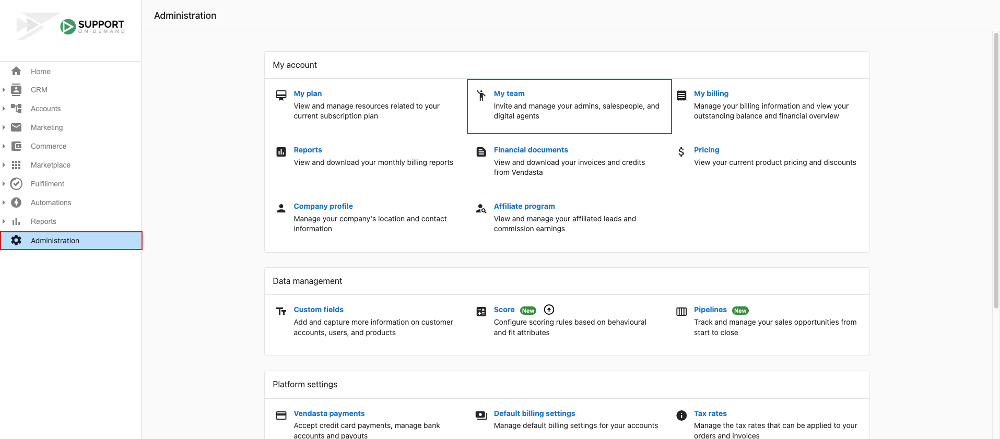

Vous pourriez avoir besoin de restreindre l'accès d'un administrateur ou d'un vendeur de Partner Center à des comptes ou à des fonctionnalités, par exemple pour limiter la liste des actions possibles, préserver la confidentialité des informations client ou simplifier l'expérience.

## Accéder à l'écran des permissions

1. Allez dans `Partner Center` → `Administration` → `My team` et trouvez l'utilisateur.
2. Cliquez sur `⋮` → `Edit member`. Pour voir la liste complète des permissions, l'utilisateur doit être administrateur. Si la case Admin est cochée, cliquez sur **Show more permissions** pour voir toutes les permissions modifiables.

## Permissions des administrateurs

Les permissions des administrateurs contrôlent ce qu'un administrateur peut voir et faire dans Partner Center, des Automations à la Marketplace, en passant par les comptes, la facturation et la gestion d'équipe.

#### Can view and edit Automations

- **Off** – L'onglet Automations est masqué dans la navigation de gauche.
- **On** – L'onglet Automations est affiché ; l'administrateur peut consulter, gérer et modifier toutes les automatisations.

#### Access to Dashboard

Lorsque cette permission est activée, l'administrateur a accès à **Home** et à **Reports** dans la navigation de Partner Center. L'accès aux rapports détaillés est ensuite contrôlé par d'autres permissions administrateur.

#### Access to company billing reports

- **On** – Accès à My billing, Financial documents, Reports, My Plan et Billing pricing.
- **Off** – Aucun accès à ces sections.

#### Able to customize the platform

- **Off** – Aucun accès au lien **Customize** sous `Partner Center` → `Administration`.
- **On** – Accès complet à **Customize** et à tout ce qu'il contient.

#### Can view and edit company profile

- **Off** – Aucun accès au lien **Company Profile** sous `Partner Center` → `Administration`.
- **On** – Accès complet à **Company Profile** et à tout ce qu'il contient.

#### Can access Marketplace

- **Off** – L'onglet Marketplace est masqué ; les prix de gros sont retirés des commandes.
- **On** – L'onglet Marketplace est affiché ; l'administrateur peut accéder à Discover Products, Products, Packages, Manage Store et Open Vendor Center. Les prix de gros sont visibles sur les commandes.

#### Can manage accounts and users

- **Off** – **Users** et **Accounts** sous l'onglet Businesses sont masqués.
- **On** – **Users** et **Accounts** sont affichés.

#### Can manage Marketing

- **Off** – L'onglet Marketing est masqué.
- **On** – L'onglet Marketing est affiché.

#### Can manage Sales

Permission héritée ; elle sera retirée à terme.

#### Can manage Task Manager

- **Off** – L'onglet Tasks est masqué.
- **On** – L'onglet Tasks est affiché ; l'administrateur peut accéder à Task Manager.

#### Can manage groups

Permet à l'administrateur de créer et de voir des groupes multi-établissements.

#### Can create and manage admins

- **Off** – Aucun accès au lien **My team** sous `Partner Center` → `Administration`.
- **On** – Accès complet à **My team** et à tout ce qu'il contient.

#### Can manage orders

- **Off** – L'administrateur peut consulter les commandes et dispose des mêmes capacités qu'un vendeur (créer et soumettre des commandes), mais ne peut pas approuver ni activer les commandes, sauf si la configuration du système le permet via des flux d'acceptation de paiement.
- **On** – L'administrateur peut approuver, refuser et activer les commandes, et les gérer entièrement, y compris facturer des commandes dans les marchés auxquels il a accès (y compris tous les marchés si son accès utilisateur est configuré pour une couverture de tous les marchés).

#### Can manage retail billing

Lors de l'utilisation de Vendasta Payments, cette permission permet à l'administrateur de :

- Créer une facture depuis `Commerce` → `Invoices`.
- Définir les prix de détail sous `Marketplace` → `Products` → `Product info`.
- Accéder à Subscriptions, Invoices, Payments, Payouts, aux notes de crédit, aux paramètres de facturation par défaut et aux taux de taxe.

#### Premium Reports

Un menu déroulant qui contrôle l'accès d'un membre d'équipe aux [Premium Reports](/reports/premium-reports/) :

- **No access to reports** – Ne peut pas ouvrir les Premium Reports.
- **View all unrestricted reports** – Peut ouvrir tout rapport partagé avec toute l'équipe. Ne peut pas modifier qui y a accès.
- **Manage permissions for all unrestricted reports** – Peut ouvrir tout rapport partagé avec toute l'équipe, et peut modifier ses paramètres de partage propres à chaque rapport.

Les rapports peuvent également être restreints à des personnes spécifiques, rapport par rapport. Consultez [Contrôles d'accès des Premium Reports](/reports/premium-reports/access-controls) pour le guide complet.

## Permissions des vendeurs

Les permissions des vendeurs contrôlent l'accès à Proposals, Inbox, Leaderboard, Pricing, Opportunities et Orders, ce qui vous permet de limiter ce qu'un membre d'équipe voit ou de simplifier son expérience.

#### Can access Proposals

- **Off** – L'onglet Proposals est masqué.
- **On** – L'onglet Proposals est affiché ; le vendeur peut consulter, gérer et modifier toutes les propositions.

#### Can access Inbox

- **Off** – Inbox est masquée dans toute la plateforme (navigation, page de profil de contact et d'entreprise).
- **On** – Inbox est disponible ; le vendeur peut consulter et interagir avec toutes les conversations de la boîte de réception.

#### Can access Leaderboard

- **Off** – L'onglet Leaderboard est masqué.
- **On** – L'onglet Leaderboard est affiché ; le vendeur peut consulter le Leaderboard.

#### Can access Pricing

- **Off** – L'onglet Pricing est masqué.
- **On** – L'onglet Pricing est affiché ; le vendeur peut consulter les prix de détail et les détails des produits.

#### Can manage Opportunities

- **All opportunities** – Le vendeur peut voir toutes les opportunités.
- **Opportunities assigned to the user** – Le vendeur ne voit que les opportunités qui lui sont assignées.

#### Can manage Orders

- **All orders** – Le vendeur peut voir toutes les commandes.
- **Orders assigned to the user** – Le vendeur ne voit que les commandes qui lui sont assignées.

## Dépannage : pourquoi un administrateur ne peut-il pas voir une certaine section ?

Si un administrateur signale qu'il ne peut pas voir une fonctionnalité ou une section à laquelle un autre administrateur a accès, la cause la plus probable est une différence dans les paramètres de permissions, et non un bogue.

### Comment vérifier et mettre à jour les permissions d'un administrateur

1. Allez dans `Partner Center` → `Administration` → `My team`.
2. Trouvez l'administrateur concerné.
3. Cliquez sur `⋮` → `Edit member`.
4. Si la case **Admin** est cochée, cliquez sur **Show more permissions** pour voir la liste complète.
5. Comparez ses paramètres à ceux d'un administrateur qui a bien accès, et ajustez-les au besoin.
6. Cliquez sur **Save**.

:::note
Seuls les administrateurs disposant de la permission **Can create and manage admins** peuvent consulter ou modifier les permissions d'un autre utilisateur.
:::
