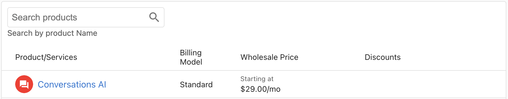

import Tabs from '@theme/Tabs';
import TabItem from '@theme/TabItem';

La section **Tarification** de l'administration vous montre le prix de gros de vos services et produits, ainsi que le modèle de facturation des produits et les remises de gros actives.

## Comprendre le tableau des tarifs

La page Tarification affiche un tableau complet de tous les produits et services disponibles avec les informations suivantes :

### Colonnes du tableau

| Colonne | Description |
|--------|-------------|
| `Product/Services` | Le nom du produit ou du service, affiché avec une icône pour faciliter l'identification |
| `Billing Model` | La méthode de facturation du produit (Standard ou Stairstep) |
| `Wholesale Price` | Le coût que vous payez pour le produit, affiché sous forme de prix de départ ou de tarif fixe |
| `Discounts` | Les remises de gros actives appliquées au produit |

## Détails de la tarification

<Tabs groupId="pricing-info">
<TabItem value="billing-models" label="Billing Models" default>

### Modèles de facturation expliqués

Les produits utilisent l'un des deux modèles de facturation suivants :

**Facturation standard**
- Structure de prix fixe
- Prix constant, quel que soit le volume

**Facturation Stairstep**
- Paliers de prix basés sur le volume ou l'utilisation
- Le prix peut diminuer à mesure que vous achetez davantage d'unités
- Généralement réservée aux partenaires qui ont un très grand volume d'activations et qui doivent acheter des produits en gros

</TabItem>

<TabItem value="price-formats" label="Wholesale Prices">

### Comprendre les prix de gros

Les prix de gros sont affichés selon plusieurs formats :

**Tarification mensuelle**
- **Starting at $X.XX/mo** - Ce produit comporte plusieurs paliers, le palier le plus bas commençant à X,XX $ par mois
- **$X.XX/mo** - Ce produit est au prix de X,XX $ par mois

**Tarification annuelle**
- **$X.XX/yr** - Ce produit est au prix de X,XX $ par an

**Frais uniques**
- **$X.XX** - Ce produit correspond à des frais uniques de X,XX $

**Options gratuites**
- **Starting at Free** - Ce produit propose un palier gratuit, avec des options payantes pour les paliers supérieurs
- **Free + $X.XX Setup fee** - Ce produit est gratuit, avec des frais d'installation uniques de X,XX $

</TabItem>

<TabItem value="discounts" label="Discounts">

### Comprendre les remises

Certains produits peuvent avoir des remises de gros actives. Les remises s'affichent dans la colonne `Discounts` et indiquent :

- Le **type de remise** (par exemple, « 100 unités gratuites par période »)
- La **date de début** à laquelle la remise est devenue active
- Les **informations de période** (mensuelle, trimestrielle, etc.)

:::info Exemple de remise
« Active Discounts: 100 free units per period starting 2021-01-03 »

Cela indique que vous recevez 100 unités gratuites du produit à chaque période de facturation, la remise ayant débuté le 3 janvier 2021.
:::

</TabItem>
</Tabs>

## Utilisation de la page Tarification

### Rechercher des produits

Utilisez la fonction de recherche pour trouver rapidement des produits spécifiques :

1. Cliquez dans le champ `Search products` en haut de la page
2. Saisissez le nom du produit ou des mots-clés
3. Le tableau se filtre automatiquement pour afficher les résultats correspondants

## Questions fréquentes

Les prix incluent-ils les taxes ?

Les prix affichés sont des prix de gros avant taxes.

Comment puis-je consulter ma tarification de gros pour un produit précis ?

Utilisez la barre de recherche en haut de la page Tarification pour filtrer les produits par nom. Vous pouvez également parcourir le tableau pour trouver des produits précis.

Quelle est la différence entre la facturation Standard et Stairstep ?

La **facturation standard** applique un prix fixe, quel que soit le volume. La **facturation Stairstep** propose une tarification par paliers où les coûts peuvent diminuer à mesure que vous achetez davantage d'unités ou que vous atteignez certains seuils de volume. La facturation Stairstep est généralement réservée aux partenaires qui ont un très grand volume d'activations et qui doivent acheter des produits en gros.

:::tip D'autres questions sur la tarification ?
Si vous avez d'autres questions sur la tarification ou si vous avez besoin d'aide pour comprendre vos coûts de gros, contactez [support@vendasta.com](mailto:support@vendasta.com) ou envoyez un courriel à billingsupport@vendasta.com. Pour savoir quoi inclure dans une demande, consultez [Bonne pratique : soumettre une demande d'assistance](../../../getting-started/partner-troubleshooting-guide.mdx#best-practice-submitting-a-support-ticket).
:::