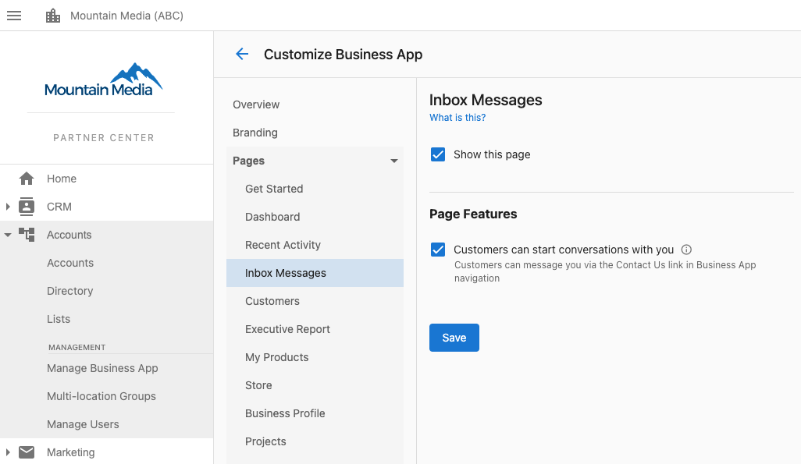

Configurez les outils de gestion des conversations et de communication : paramètres de discussion, modèles de réponse, acheminement des conversations et qui peut voir l'onglet Conversations dans Business App. Vous pouvez désactiver l'onglet Conversations pour des utilisateurs spécifiques ou pour tous les comptes d'un marché.

## Désactiver l'onglet Conversations

L'onglet Conversations dans Business App peut être masqué pour les clients, pour des utilisateurs spécifiques ou pour tous les comptes d'un marché.

:::warning
Retirer l'accès des utilisateurs à Conversations retire également l'accès à Conversations Pro, à la capture de prospects et à la messagerie SMS. Il n'est pas recommandé de le désactiver, sauf pour une raison précise.
:::

### Pour des utilisateurs spécifiques

1. Allez dans `Partner Center` → `Accounts` → `Manage Users`
2. Sélectionnez le ou les utilisateurs à modifier, puis cliquez sur `Bulk Update x users`

   

3. Sous `Tab Access`, ouvrez le menu déroulant `Conversations`, sélectionnez `Turn Off`, puis `Apply Changes to Users`

### Pour tous les utilisateurs d'un marché

1. Allez dans `Partner Center` → `Administration` → `Customize Business App` → `Pages` → `Conversations`
2. Décochez la case `Show this page` et enregistrez pour retirer Conversations de tous les clients de ce marché

   

## Ce que vous pouvez configurer

- **Paramètres de discussion** – Préférences de clavardage en direct et de messagerie
- **Modèles de réponse** – Modèles de réponse rapide
- **Réponses automatiques** – Réponses automatisées aux demandes courantes
- **Acheminement des conversations** – Répartition des conversations entre les membres de l'équipe
- **Intégrations** – Plateformes de communication externes
- **Visibilité des onglets** – Quels utilisateurs ou marchés voient l'onglet Conversations (voir ci-dessus)

Pour obtenir de l'aide concernant les paramètres de conversation, contactez le soutien technique.
