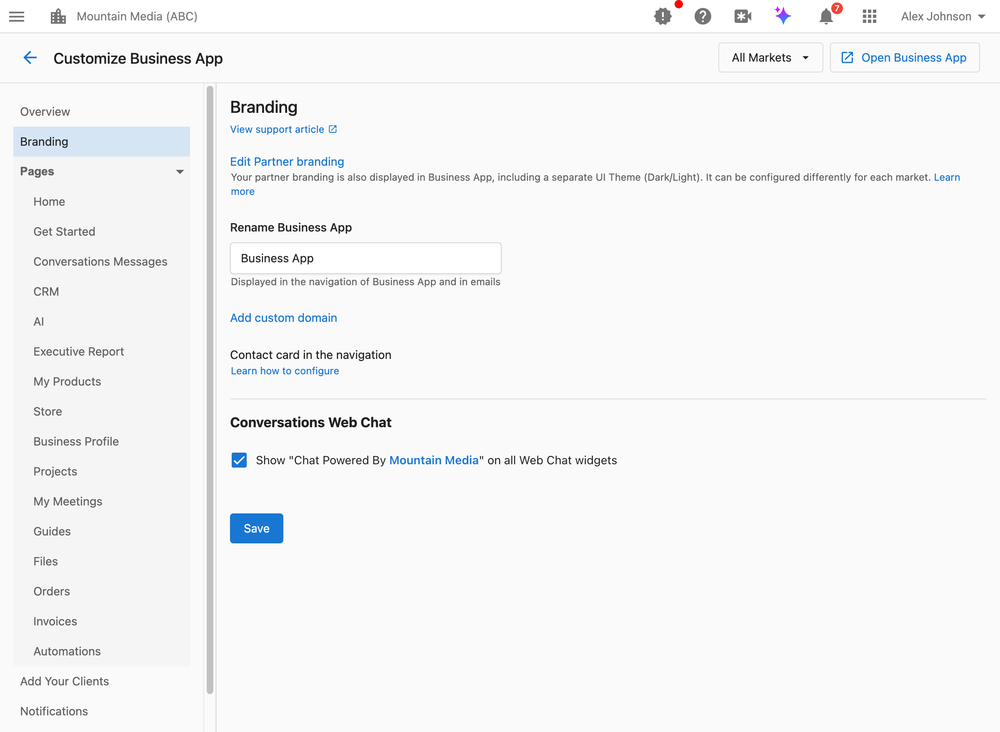

La section Branding dans Customize Business App contrôle la façon dont votre marque apparaît dans l'expérience Business App de vos clients. Ces paramètres vous permettent de renommer l'application, d'accéder à la configuration du domaine personnalisé et de contrôler l'image de marque du widget de clavardage Web.

## Comment accéder aux paramètres de marque?

Accédez à `Partner Center` → `Accounts` → `Manage Business App` → `Customize Business App` → `Branding`.

## Comment renommer Business App?

Le paramètre Business App name change le nom affiché « Business App » pour votre nom personnalisé dans toute l'interface client.

**Ce que ce paramètre fait :**
- Change le nom affiché dans la navigation de Business App
- Met à jour le nom dans les communications par courriel envoyées aux clients
- Applique le nom de votre marque à l'ensemble de l'expérience client

**Quand utiliser ceci :**
- Vous voulez offrir la plateforme en marque blanche avec le nom de votre marque
- « Business App » ne correspond pas à la voix ou à la terminologie de votre marque
- Vous voulez que les clients reconnaissent votre produit par son nom de marque

**Comment configurer :**

1. Accédez à `Partner Center` → `Accounts` → `Manage Business App` → `Customize Business App` → `Branding`.
2. Trouvez le champ `Rename Business App`.
3. Entrez le nom souhaité (par exemple « ClientHub », « MyAgency Portal », « Growth Dashboard »).
4. Cliquez sur `Save`.

**Ce que les clients voient :**
Le nouveau nom apparaît dans la barre latérale de navigation, les titres de page et les communications par courriel à la place de « Business App ».

:::tip Bonne pratique
Gardez le nom de votre application court (2 à 3 mots) et facile à reconnaître. Évitez les caractères spéciaux qui pourraient ne pas s'afficher de façon uniforme sur tous les appareils.
:::

## Comment ajouter un domaine personnalisé?

Un domaine personnalisé permet aux clients d'accéder à Business App à partir de votre propre URL de marque (par exemple, `app.youragency.com` au lieu de l'URL Vendasta par défaut).

**Quand vous avez besoin d'un domaine personnalisé :**
- Vous voulez une expérience entièrement en marque blanche
- Votre marque exige que les clients ne voient que votre domaine
- Vous voulez bâtir la confiance avec une URL reconnaissable

**Comment configurer :**
Cliquez sur le lien `Add custom domain` dans la section Branding pour accéder à la configuration du domaine. Pour des instructions de configuration détaillées, consultez [Personnaliser vos domaines](/partner-center#customize-your-domains).

## Comment personnaliser la carte Contact Us?

La carte Contact Us apparaît dans la navigation de Business App et affiche vos coordonnées aux clients. Vous pouvez aussi ajouter un lien de prise de rendez-vous afin que les clients puissent réserver du temps avec leur représentant assigné directement à partir de la carte.

**Ce que ce paramètre fait :**
- Affiche un bouton `Book a meeting` sur la carte de contact de Business App
- Renvoie vers un lien de rendez-vous CalendarHero, ou tout autre lien de prise de rendez-vous que vous fournissez
- Apparaît pour les comptes assignés au représentant dont le lien est configuré

:::info
Lorsque vous accédez au compte d'un client en mode simulation depuis Business App, vous ne pouvez pas démarrer une conversation avec le représentant à partir de cette vue. Pour tester le lien de réservation, connectez-vous directement à Business App en tant que ce client.
:::

**Comment configurer :**

1. Ajoutez un lien de réservation au profil du représentant :
   1. Accédez à `Partner Center` → `Administration` → `My team`.
   2. Trouvez le représentant, sélectionnez les trois points à côté de son nom, puis choisissez `Edit Salesperson`.
   3. Faites défiler jusqu'au champ `Book a meeting link`.
   4. Entrez l'URL du rendez-vous.
   5. Cliquez sur `Save`.
2. Assignez le représentant au compte :
   1. Accédez à `Partner Center` → `Accounts` → `Manage Accounts`.
   2. Sélectionnez un compte et choisissez `Edit`.
   3. Sous `Administration`, assurez-vous que le bon représentant est assigné.
   4. Une fois enregistré, les clients de ce compte voient un bouton `Book a meeting` sur la carte de contact de Business App.

## Comment contrôler l'image de marque du pied de page du clavardage Web?

Le paramètre Conversations Web Chat footer contrôle si le nom de votre marque et le lien vers votre site Web apparaissent au bas des widgets de clavardage Web sur les sites de vos clients.

**Ce que ce paramètre fait :**
Lorsqu'il est activé, affiche « Chat Powered By [Your Partner Name] » (avec un lien facultatif vers votre site Web) sur tous les widgets de clavardage Web actifs sur les comptes de vos clients.

**Quand l'activer :**
- Vous voulez promouvoir votre marque grâce aux widgets de clavardage des clients
- Vous voulez des liens retour vers votre site Web pour des avantages SEO
- Vous êtes à l'aise avec le fait que les utilisateurs finaux voient votre marque aux côtés de celle de vos clients

**Quand le désactiver :**
- Vous voulez une expérience entièrement en marque blanche, sans aucune référence à votre marque
- Vos clients préfèrent que leurs widgets de clavardage apparaissent entièrement sous leur propre marque
- Vous agissez comme partenaire silencieux derrière la marque de vos clients

**Comment configurer :**

1. Accédez à `Partner Center` → `Accounts` → `Manage Business App` → `Customize Business App` → `Branding`.
2. Faites défiler jusqu'à la section `Conversations Web Chat`.
3. Basculez la case à cocher pour afficher ou masquer l'image de marque du pied de page.
4. Cliquez sur `Save`.

**Ce qui apparaît dans le pied de page :**
- Si une URL de site Web est configurée dans votre profil de partenaire : « Chat Powered By [Your Name] » avec un lien cliquable vers votre site Web (incluant des paramètres UTM pour le suivi)
- Si aucune URL de site Web n'est configurée : « Chat Powered By [Your Name] » sans lien

:::info
Le nom de votre partenaire et l'URL de votre site Web sont configurés dans votre [Company Profile](https://partners.vendasta.com/company-profile). Le pied de page du clavardage Web utilise automatiquement ces valeurs.
:::

## Ressources connexes

Pour des options d'image de marque complètes, y compris les logos, les couleurs et les thèmes, consultez [Visual Branding and Identity](/administration/platform-settings/partner-branding/visual-branding-and-identity).

## FAQ

Puis-je utiliser des noms d'application différents selon les marchés?

Non, le nom de Business App est défini au niveau du partenaire et s'applique à tous les marchés. Si vous avez besoin d'une image de marque propre à chaque marché, envisagez plutôt d'utiliser une image de marque visuelle spécifique au marché (logos, couleurs).

Où le nom d'application personnalisé apparaît-il?

Le nom personnalisé apparaît :
- Dans la barre latérale de navigation de Business App
- Dans les communications par courriel aux clients
- Dans les messages de bienvenue et le contenu d'intégration
- Dans tout texte d'interface qui afficherait autrement « Business App »

Renommer Business App affecte-t-il les favoris existants?

Non. Le renommage ne change que le texte affiché. Les URL et les favoris continuent de fonctionner normalement.

Y a-t-il une limite de caractères pour le nom de l'application?

Oui, la longueur maximale est de 200 caractères. Cependant, pour un meilleur affichage sur tous les appareils et tailles d'écran, gardez votre nom sous les 25 caractères.

Puis-je retirer complètement le pied de page du clavardage Web?

Oui. Désactivez la case à cocher « Show Chat Powered By » pour retirer complètement votre image de marque du pied de page du clavardage Web.

Quels paramètres UTM sont ajoutés au lien du pied de page du clavardage Web?

S'il est activé, le lien du pied de page inclut `?utm_source=webchat&utm_medium=referral` pour le suivi analytique dans votre outil d'analyse de site Web.

