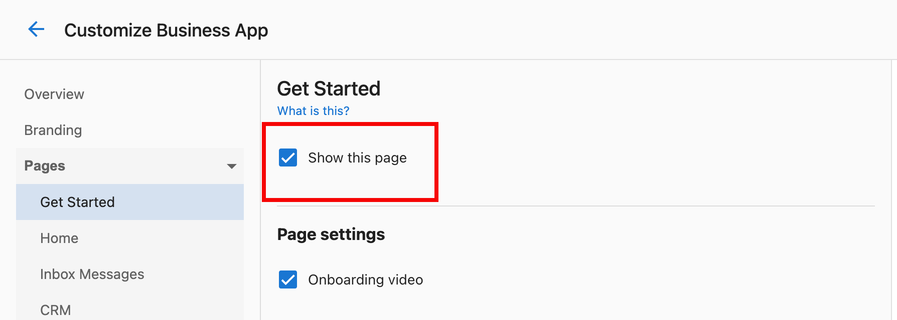

# Customize Business App

Contrôlez la mise en page, la navigation et les éléments visuels de l'expérience Business App de vos clients. Affichez ou masquez des pages, personnalisez l'image de marque et créez une interface adaptée à votre entreprise et aux besoins de vos clients.

## Comment y accéder

Allez dans `Partner Center` → `Administration` → `Customize Business App`.

## Ce que vous pouvez faire

- **Visibilité des pages et navigation** – Afficher ou masquer les sections du tableau de bord (Grow, Listings, Protect, Connect, Reputation), la page Automations et l'onglet Guides; organiser l'interface selon votre flux de travail
- **Image de marque et identité visuelle** – Renommer Business App, définir le placement du logo, maintenir la cohérence visuelle dans toute l'interface
- **Expérience utilisateur** – Ajouter des bannières de notification, du contenu personnalisé (vidéos, messages) et contrôler la façon dont les clients interagissent avec les fonctionnalités

## Visibilité des pages et navigation

### Afficher ou masquer les pages du tableau de bord

1. Allez dans `Partner Center` → `Administration` → `Customize Business App` → `Pages`
2. Sélectionnez la page à modifier : `Grow`, `Listings`, `Protect`, `Connect`, `Reputation`, et d'autres
3. Cochez ou décochez la case `Show this page` de la page, puis enregistrez

### Page Automations

1. Dans `Customize Business App`, ouvrez `Pages` → `Automations`
2. Cochez ou décochez la case `Show this page` et enregistrez (coché = les clients voient les automatisations; décoché = page masquée)
3. Les changements s'appliquent immédiatement; les automatisations continuent de s'exécuter lorsque les déclencheurs sont atteints même si la page est masquée

### Section Guides

1. Allez dans `Customize Business App` → `Pages` → `Guides`
2. Basculez la visibilité de l'onglet **Guides** et enregistrez (Show = les clients voient les guides; Hide = l'onglet est retiré)
3. Avec plusieurs marchés, configurez par marché

:::info
Masquer la section Guides peut simplifier l'interface lorsque vos clients n'ont pas besoin de guides intégrés à l'application ou que vous formez par d'autres canaux.
:::

## Image de marque et identité visuelle

### Renommer Business App

1. Allez dans `Customize Business App` → `Branding`
2. Sélectionnez **Rename Business App**, entrez le nom souhaité, puis enregistrez

Le nom est mis à jour dans toute l'interface client et dans les courriels.

### Placement du logo

1. Dans `Customize Business App` → `Branding`, téléversez votre logo si nécessaire
2. Utilisez les options de placement : désactivez **Display your logo in footer of Business App navigation** pour déplacer le logo du bas à gauche vers le haut à gauche
3. Prévisualisez et enregistrez

## Expérience utilisateur

### Bannières de notification

1. Dans **Customize Business App**, ouvrez l'onglet **Notifications** → **Global notification banner**
2. Définissez le texte du message, la durée d'affichage, le style et le public cible
3. Ajoutez une date d'expiration si nécessaire, puis activez

Utilisez les bannières pour des annonces, des mises à jour ou des promotions.

### Paramètres d'invitation des clients

1. Créez une page de destination (par exemple avec un Acquisition Widget pour l'inscription ou les essais)
2. Allez dans `Customize Business App` → `Add Your Clients`
3. Collez l'URL de la page de destination dans **Invitation Landing Page URL** et enregistrez

Un bouton **Invite a business** apparaît alors dans le profil du client; les clients peuvent partager votre page de destination pour inviter d'autres entreprises.

## Questions fréquentes

À quelle vitesse les changements d'interface prennent-ils effet?

La plupart des changements (visibilité des pages, image de marque) prennent effet immédiatement. Les clients les voient à leur prochaine actualisation ou connexion.

Puis-je personnaliser l'interface différemment selon les clients?

Oui. De nombreux paramètres peuvent être définis par client ou par groupe. Vous pouvez aussi contrôler au niveau de l'utilisateur : `Partner Center` → `Accounts` → `Manage Users` → trois points à côté de l'utilisateur → **Edit Permissions**.

Que se passe-t-il si je masque une page que mes clients utilisent?

L'accès à cette section est retiré immédiatement. Communiquez à l'avance et proposez des solutions de rechange si nécessaire.

Puis-je prévisualiser les changements d'interface avant de les appliquer?

Certains paramètres offrent des aperçus. La bonne pratique consiste à tester avec un environnement de préproduction ou un groupe restreint avant de déployer à tout le monde.

Comment savoir quelles pages mes clients utilisent?

Utilisez les rapports d'analyse et d'engagement pour décider quoi afficher ou masquer.

Puis-je restaurer le nom par défaut de Business App après l'avoir renommé?

Oui. Vous pouvez remettre le nom à « Business App » ou choisir un autre nom à tout moment dans les paramètres de marque.

Quelle est la différence entre masquer une page et désactiver une fonctionnalité?

Masquer une page la retire de la navigation; la fonctionnalité peut rester accessible autrement. Désactiver une fonctionnalité en retire l'accès et le fonctionnement.

Comment le placement du logo affecte-t-il les utilisateurs mobiles?

Testez la visibilité et la taille du logo sur ordinateur et sur mobile afin que l'image de marque reste cohérente.

Puis-je planifier des bannières de notification pour des moments précis?

Vérifiez les paramètres de la bannière pour les options de minutage et de planification.

Que devrais-je considérer lors de la personnalisation pour mes clients?

Concentrez-vous sur les besoins des clients, la simplicité et la fonctionnalité : retirez les fonctionnalités inutilisées, gardez la navigation claire, maintenez la cohérence de la marque et utilisez les commentaires des clients.

## Articles de cette section

- **[Paramètres de marque](./branding-settings.mdx)** – Nom de l'application, domaine personnalisé, image de marque du pied de page du clavardage Web
- **[Ajouter vos clients](./add-your-customers-settings.mdx)** – Inscription libre-service, gestion des utilisateurs, recommandations, options d'acquisition
- **[Notifications et campagnes](./notifications-and-campaigns.mdx)** – Bannières d'annonce et campagnes d'intégration
- **[Paramètres multi-établissements](./multi-location-settings.mdx)** – Périodes de rapport par défaut pour les clients multi-établissements
- **[Paramètres de visibilité des pages](./page-visibility-settings.mdx)** – Contrôlez quelles pages et fonctionnalités les clients voient
- **[Guide de configuration](./setup-guide.mdx)** – Configuration de bout en bout, configuration mobile, liste de vérification de lancement et dépannage
