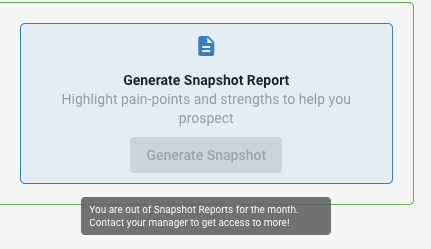

## Qu'est-ce que la gestion de l'équipe de vente?

La gestion de l'équipe de vente offre un contrôle complet sur ce que votre équipe de vente peut accéder, voir et faire dans la plateforme. Vous pouvez configurer différents niveaux de permissions, contrôler la visibilité des prix, gérer les capacités de rapports et définir des restrictions précises pour vous assurer que votre équipe fonctionne dans les paramètres d'affaires définis.

## Pourquoi la gestion de l'équipe de vente est-elle importante?

Une configuration adéquate de l'équipe de vente protège les renseignements commerciaux sensibles tout en donnant aux membres de l'équipe les outils dont ils ont besoin pour réussir. Vous pouvez maintenir la confidentialité des prix, prévenir les actions non autorisées et étendre efficacement les opérations de l'équipe en établissant des niveaux d'accès et des restrictions appropriés.

## Qu'est-ce qui est inclus avec la gestion de l'équipe de vente?

### Contrôle d'accès basé sur les rôles
- **Permissions du gestionnaire des ventes** : Accès complet au marché et capacités administratives
- **Permissions du vendeur** : Accès limité selon les attributions et les paramètres du marché
- **Paramètres d'accès à l'échelle du marché** : Contrôlez la visibilité des comptes sur les territoires
- **Restrictions basées sur les attributions** : Limitez l'accès aux comptes spécifiquement attribués

### Contrôles des prix et des produits
- **Visibilité des prix de gros** : Affichez ou masquez les renseignements de coûts aux vendeurs
- **Restrictions des produits autonomes** : Contrôlez les capacités de vente de produits individuels
- **Contrôles de sélection des produits** : Gérez quels produits les membres de l'équipe peuvent vendre
- **Protection des prix** : Maintenez la confidentialité des structures de coûts

### Permissions de communication et de marketing
- **Accès aux campagnes courriel** : Activez ou désactivez les capacités de campagnes marketing
- **Outils de communication client** : Contrôlez les fonctionnalités d'interaction directe avec les clients
- **Génération de campagnes** : Gérez qui peut créer et envoyer du matériel marketing
- **Accès aux outils marketing** : Configurez la disponibilité des fonctionnalités promotionnelles

### Limitations de rapports et d'analytique
- **Limites de rapports snapshot** : Définissez des plafonds de génération mensuels par vendeur
- **Contrôles d'accès aux rapports** : Définissez quelle analytique les membres de l'équipe peuvent consulter
- **Suivi de l'utilisation** : Suivez la génération de rapports et l'activité de l'équipe
- **Dérogations administratives** : Conservez l'accès administrateur peu importe les restrictions

## Comment configurer les rôles de l'équipe de vente

### Comprendre les différences de rôles

#### Capacités du gestionnaire des ventes
Les gestionnaires des ventes ont un accès élargi et des fonctions administratives :
- **Accès aux comptes à l'échelle du marché** : Peuvent voir tous les comptes de leur marché, peu importe l'attribution
- **Restrictions de dérogation** : Accèdent aux comptes même lorsque l'accès à l'échelle du marché est désactivé
- **Fonctions administratives** : Configurent les paramètres de l'équipe et gèrent les permissions
- **Accès complet aux rapports** : Génèrent un nombre illimité de rapports et consultent une analytique complète

#### Capacités du vendeur
Les vendeurs disposent d'un accès ciblé conçu pour les activités de vente quotidiennes :
- **Accès basé sur les attributions** : Ne peuvent voir que les comptes qui leur sont spécifiquement attribués (lorsque l'accès à l'échelle du marché est désactivé)
- **Accès administratif limité** : Ne peuvent pas modifier les paramètres ou les permissions de l'équipe
- **Rapports restreints** : Assujettis aux limites mensuelles de rapports snapshot
- **Accès contrôlé aux fonctionnalités** : Certaines fonctionnalités peuvent être désactivées selon la configuration

### Configurer les paramètres d'accès à l'échelle du marché

L'accès à l'échelle du marché détermine si les vendeurs peuvent voir tous les comptes de leur territoire :

1. Accédez à `Administration` → `Customize` → `Sales` → `Settings`
2. Repérez la configuration `Market-wide access`
3. Activez pour permettre aux vendeurs de voir tous les comptes du marché
4. Désactivez pour limiter les vendeurs aux comptes attribués seulement
5. Enregistrez la configuration

:::info
Les gestionnaires des ventes ont toujours accès à tous les comptes de leur marché, peu importe le paramètre d'accès à l'échelle du marché. Cela garantit une supervision de gestion et des capacités administratives appropriées.
:::

## Comment contrôler la visibilité des prix

### Masquer les prix de gros aux vendeurs

Pour protéger les renseignements de coûts sensibles tout en maintenant la fonctionnalité de vente :

1. Allez à `Administration` → `Customize`
2. Déployez la section `Sales`
3. Faites défiler jusqu'aux contrôles de prix
4. Désactivez `Show wholesale prices`
5. Enregistrez les changements

Ce paramètre empêche les vendeurs de voir les coûts des produits tout en leur permettant de créer des devis et de traiter des commandes au prix standard.

### Bonnes pratiques de visibilité des prix
- **Protéger les marges** : Masquez les prix de gros pour maintenir les marges bénéficiaires
- **Favoriser la transparence** : Affichez les prix aux gestionnaires des ventes pour la supervision
- **Surveiller les changements** : Suivez le moment où les paramètres de visibilité des prix sont modifiés
- **Former les membres de l'équipe** : Assurez-vous que les vendeurs comprennent les politiques de prix

## Comment configurer les permissions de produits et de campagnes

### Activer l'accès aux campagnes courriel

Pour permettre aux vendeurs d'envoyer des campagnes marketing :

1. Accédez à `Partner Center` → `Administration` → `Customize` → `Sales`
2. Activez `Salespeople can send campaigns`
3. Configurez toute restriction propre aux campagnes
4. Enregistrez les paramètres

Cela permet aux vendeurs de créer et d'envoyer des campagnes de marketing par courriel directement à leurs comptes attribués.

:::info
Repérez la bascule `Salespeople can send campaigns` dans la section Sales des paramètres de personnalisation. Ce contrôle détermine si votre équipe de vente peut accéder aux fonctionnalités de campagnes dans Partner Center.
:::

## Comment gérer les limites de rapports snapshot

### Définir des limites de rapports mensuelles

Pour contrôler combien de rapports snapshot chaque vendeur peut générer par mois :

1. Accédez à `Administration` → `Customize` → `Sales`
2. Cochez `Limit monthly Snapshot Reports` sous Settings
3. Saisissez la `Snapshot Report limit` souhaitée
4. Configurez des limites pour des marchés précis au besoin
5. Enregistrez la configuration

### Limites de snapshot propres à un marché

Bien qu'il n'existe pas de moyen direct de limiter les snapshots par marché, vous pouvez limiter les snapshots par vendeur au sein de marchés précis :

**Pour des marchés individuels :**
1. Accédez à la section `Markets` des paramètres de personnalisation
2. Sélectionnez votre marché cible
3. Allez à la configuration `Sales` de ce marché
4. Cochez la case `limit monthly snapshot report`
5. Définissez la `snapshot creation limit` pour les vendeurs de ce marché

:::info
Si plusieurs vendeurs travaillent dans un marché, la limite du marché représente le maximum total admissible que tous les vendeurs de ce marché peuvent créer combinés.
:::

:::warning
Si vous avez personnalisé des marchés, vous devrez ajuster ce paramètre pour chaque marché individuellement. Vérifiez la section Markets pour voir quels marchés ont déjà un paramètre personnalisé configuré, puisque le changement par défaut ne remplacera pas ceux-ci.
:::

### Gestion des limites de rapports
- **Restriction complète** : Définissez la limite à 0 pour désactiver entièrement la génération de rapports
- **Réinitialisation mensuelle** : Toutes les limites se réinitialisent à 12 h 00 UTC le premier jour de chaque mois
- **Accès administratif** : Les rapports générés par un administrateur ne comptent pas dans les limites des vendeurs
- **Intégration aux campagnes** : Les limites de rapports affectent les campagnes courriel qui incluent des étapes de génération de rapports

### Lorsque les limites sont dépassées

Lorsqu'un vendeur atteint sa limite mensuelle, il verra une notification l'empêchant de générer d'autres rapports :

## Foire aux questions

Quelle est la différence entre un gestionnaire des ventes et un vendeur?

**Différences d'accès clés :**

**Gestionnaires des ventes :**
- Peuvent voir et accéder à **tous** les comptes de leur marché, peu importe la personne attribuée
- Conservent l'accès complet même lorsque la configuration `Market-wide access` est **désactivée**
- Peuvent déroger aux restrictions d'accès à l'échelle du marché

**Vendeurs :**
- Ne peuvent voir que les comptes qui leur sont spécifiquement attribués lorsque `Market-wide access` est **désactivé**
- Limités à leurs comptes attribués, à moins que l'accès à l'échelle du marché soit activé
- Assujettis aux paramètres de configuration de l'accès à l'échelle du marché

**Emplacement de la configuration :**
Les paramètres d'accès à l'échelle du marché se trouvent dans `Partner Center` → `Administration` → `Customize` → `Sales` → `Settings`.

Cette distinction garantit une séparation appropriée des comptes tout en donnant aux gestionnaires des ventes la supervision dont ils ont besoin pour gérer efficacement leurs équipes.

Comment masquer les prix de gros à mes vendeurs?

Vous pouvez empêcher vos vendeurs de voir les prix de gros des produits Marketplace :

1. Allez à `Partner Center` → `Administration` → `Customize`
2. Déployez la section `Sales`
3. Faites défiler et désactivez `Show wholesale prices`

Ce paramètre masque les prix aux vendeurs tout en leur permettant de créer des devis et de traiter des commandes au prix standard. Cela aide à protéger vos marges bénéficiaires tout en maintenant la fonctionnalité opérationnelle.

Puis-je désactiver complètement la génération de rapports snapshot pour les vendeurs?

Oui, vous pouvez désactiver entièrement la génération de rapports snapshot en fixant la limite mensuelle à 0. Cela empêche les vendeurs de générer des rapports tout en maintenant l'accès administrateur.

Les rapports générés par un administrateur comptent-ils dans les limites des vendeurs?

Les rapports générés directement à partir de comptes administrateurs ne comptent pas dans les limites des vendeurs. Toutefois, si vous incarnez un vendeur, ces rapports compteront dans son total.

Comment les limites de rapports snapshot affectent-elles les campagnes courriel?

Les vendeurs ne peuvent pas ajouter de comptes aux campagnes qui incluent des étapes de génération de rapports snapshot s'ils ont dépassé leur limite mensuelle. Les campagnes lancées à partir de comptes administrateurs ne sont pas affectées.

Quand les limites de rapports mensuelles se réinitialisent-elles?

Toutes les limites mensuelles se réinitialisent à 12 h 00 UTC le premier jour de chaque mois. Vous pouvez vérifier l'heure UTC actuelle pour savoir exactement quand les limites seront réinitialisées.

Les vendeurs peuvent-ils voir les prix de gros si je les masque?

Non, lorsque les prix de gros sont masqués, les vendeurs ne peuvent pas voir les coûts des produits. Ils peuvent tout de même créer des devis et traiter des commandes en utilisant les structures de prix client standard.

Qu'arrive-t-il si j'active les campagnes courriel pour les vendeurs?

Les vendeurs pourront créer et envoyer des campagnes de marketing par courriel à leurs comptes attribués. Ils auront accès aux outils et modèles de création de campagnes selon leur niveau de permission.

Puis-je définir des limites de rapports snapshot différentes pour différents marchés?

Oui, vous pouvez configurer différentes limites mensuelles pour chaque marché. Bien qu'il n'existe pas de limite directe à l'échelle du marché, vous pouvez définir des limites par vendeur au sein de marchés précis :

1. Accédez à la section `Markets` des paramètres de personnalisation
2. Sélectionnez votre marché cible
3. Configurez `limit monthly snapshot report` pour ce marché
4. Définissez la `snapshot creation limit` pour les vendeurs de ce marché

À retenir : Si plusieurs vendeurs travaillent dans un marché, la limite s'applique à chaque vendeur individuel, et non comme un total combiné pour le marché.

Comment savoir quels vendeurs ont atteint leurs limites de rapports?

Vous pouvez surveiller la génération de rapports grâce aux fonctionnalités d'analytique et de rapports administrateur. Les vendeurs qui atteignent leurs limites recevront des notifications lorsqu'ils tenteront de générer d'autres rapports.

## Captures d'écran ou vidéos

<iframe 
  src="https://drive.google.com/file/d/11_cFgRQLN_Ez6UMK45Tn2O0_yp96AaZI/preview" 
  width="640" 
  height="480" 
  allowFullScreen
></iframe>
