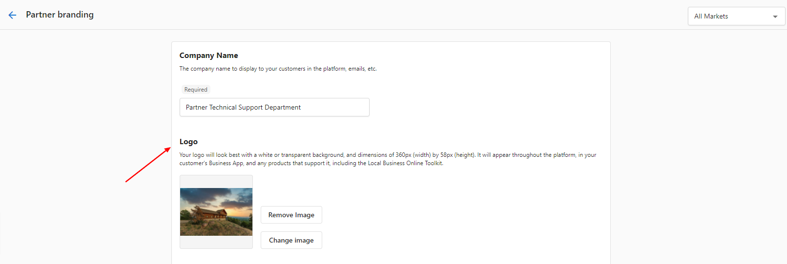
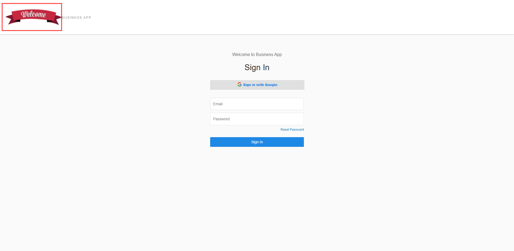
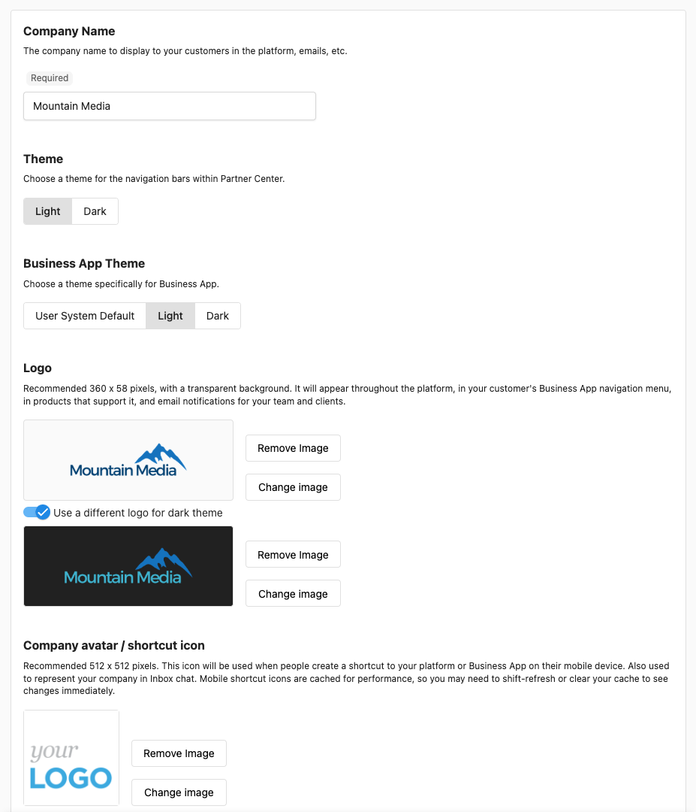

Personnalisez l'apparence de votre plateforme avec vos propres logos, couleurs, nom d'entreprise et éléments visuels. L'image de marque en marque blanche assure une identité cohérente partout où les clients voient la plateforme : Business App, campagnes d'e-mails et communications avec les clients.

## Pourquoi c'est important

Une image de marque forte offre une expérience unifiée et professionnelle et renforce votre entreprise. La marque blanche supprime les autres marques afin que les clients ne voient que la vôtre, ce qui renforce la confiance et correspond à la façon dont vous présentez votre entreprise ailleurs.

## Ce qui est inclus

- **Identité de marque** – Nom de l'entreprise, logos, thèmes de couleurs, favicon
- **Marque blanche** – Remplacer les références à d'autres marques sur toute la plateforme
- **Multi-marchés** – Image de marque différente par marché ; logos génériques ou spécifiques au marché pour la connexion
- **Technique** – Conseils sur le format et la taille des fichiers ; les changements s'appliquent rapidement

## Configurer le nom de l'entreprise et l'image de marque principale

1. Allez dans `Partner Center` → `Administration` → `Partner branding`
2. Définissez `Company Name` – Saisissez le nom que vous voulez voir dans les communications clients et sur la plateforme
3. Enregistrez

## Configurer le thème de couleurs

1. Dans `Partner branding`, ouvrez la section `Theme`
2. Définissez la couleur `Primary` (et toute couleur secondaire/d'arrière-plan)
3. Prévisualisez, puis enregistrez

Le thème s'applique dans les zones destinées aux clients.

## Gérer les logos

### Téléverser le logo principal

1. Allez dans `Partner Center` → `Administration` → `Partner branding` → `Logo`
2. Téléversez votre logo (PNG ou JPG ; PNG transparent recommandé)
3. Utilisez un fichier haute résolution pour un affichage net sur différents appareils
4. Positionnez et enregistrez

### Image de marque spécifique au marché

1. Dans `Partner branding`, utilisez le menu déroulant `All Markets` (en haut à droite) pour sélectionner un marché
2. Définissez les logos, couleurs et nom d'entreprise pour ce marché
3. Enregistrez ; répétez pour les autres marchés

### Image de marque de la page de connexion

1. Dans `Partner branding` → `Logo`, téléversez le logo que vous voulez sur la page de connexion
2. **Remarque :** La page de connexion ne peut pas être entièrement personnalisée en marque blanche. Avec plusieurs marchés, vous pouvez utiliser un logo générique pour le marché par défaut afin que l'image de marque spécifique au marché apparaisse après la connexion.

:::info
Vous ne pouvez pas personnaliser entièrement la page de connexion en marque blanche. Utiliser un logo générique pour le marché par défaut permet à l'image de marque spécifique au marché de s'afficher une fois les utilisateurs dans Business App.
:::

## Favicon et icônes de navigateur

### Téléverser le favicon

1. Allez dans `Partner Center` → `Administration` → `Partner branding` → `Favicon`
2. Utilisez un fichier `ICO` (par ex. favicon.ico). Les fichiers PNG/JPG ne sont pas acceptés.
3. Taille recommandée : 16 × 16 ou 32 × 32 px
4. Téléversez et vérifiez qu'il apparaît dans les onglets du navigateur

### Dépannage du favicon

- **Mauvais format** – Utilisez uniquement .ico. Convertissez PNG/JPG en ICO si nécessaire.
- **Flou ou déformé** – Utilisez 16 × 16 ou 32 × 32 px ; gardez un design simple.
- **Ne se met pas à jour** – Videz le cache du navigateur ou essayez une fenêtre privée ; les favicons sont mis en cache.

### Avatar de l'entreprise / icône de raccourci

1. Dans `Partner branding`, définissez `Company Avatar` (image carrée pour les profils, contextes réduits)
2. Définissez `Shortcut Icon` pour l'écran d'accueil mobile et les favoris (512 × 512 px ; GIF, JPG ou PNG)
3. Enregistrez et testez sur différents appareils

## Où l'image de marque apparaît

- **Business App** – Logos dans la navigation et les en-têtes, couleurs de marque, nom d'entreprise, favicon dans les onglets
- **E-mails** – Logo, couleurs de marque, nom d'entreprise dans les en-têtes, pieds de page et informations de l'expéditeur
- **Connexion et espaces clients** – Connexion personnalisée (avec les limites ci-dessus) ; image de marque spécifique au marché après la connexion

## Foire aux questions

Puis-je personnaliser entièrement la plateforme en marque blanche ?

Oui, pour la plupart des zones. Vous pouvez remplacer les logos, les couleurs, le nom de l'entreprise et la plupart des éléments visuels. Certaines options peuvent dépendre de votre abonnement.

Pourquoi mon favicon ne se téléverse-t-il pas ?

Les favicons doivent être des fichiers ICO (par ex. image.ico, et non image.png ou image.jpg). Allez dans `Partner Center` → `Administration` → `Partner branding` → `Favicon`.

Si le problème persiste : vérifiez que le fichier est bien en .ico, gardez une petite taille (16 × 16 ou 32 × 32), ou essayez de recréer le fichier ICO. Si le problème continue, contactez le support.

Puis-je personnaliser la page de connexion de Business App ?

Vous ne pouvez pas personnaliser entièrement la page de connexion en marque blanche. Avec plusieurs marchés, utilisez un logo générique pour le marché par défaut ; ce logo s'affiche à la connexion, et l'image de marque spécifique au marché s'affiche à l'intérieur de Business App après la connexion.

Pour modifier l'image de marque : `Partner Center` → `Administration` → `Partner branding` → `Logo`. Pour plusieurs marchés, utilisez l'onglet `All Markets` (en haut à droite) et personnalisez par marché.

À quelle vitesse les changements d'image de marque prennent-ils effet ?

La plupart des changements s'appliquent immédiatement. Les favicons peuvent prendre du retard en raison de la mise en cache du navigateur.

Quels formats de fichiers fonctionnent le mieux pour les logos ?

Le PNG avec un arrière-plan transparent est idéal. Utilisez une haute résolution pour une clarté optimale sur différents appareils.

Puis-je avoir une image de marque différente selon les marchés ?

Oui. Utilisez le sélecteur de marché dans Partner branding pour définir les logos, couleurs et nom d'entreprise par marché.

Que se passe-t-il si je ne configure pas d'image de marque personnalisée ?

La plateforme utilise des visuels par défaut. Une image de marque personnalisée offre une expérience plus professionnelle et cohérente.

Y a-t-il des limites d'abonnement sur l'image de marque ?

Certaines options de marque blanche peuvent varier selon le forfait. Consultez votre abonnement ou contactez le support pour plus de détails.

Comment tester l'image de marque avant de la déployer ?

Utilisez les options d'aperçu disponibles dans les paramètres, et testez auprès d'un petit groupe avant de l'appliquer partout.

Que faire si mon image de marque ne s'affiche pas correctement ?

Vérifiez les formats de fichiers, les tailles d'image et videz le cache du navigateur. Si le problème persiste, contactez le support en précisant les détails.

## Aperçu et tests

L'interface de gestion de la marque affiche un aperçu en direct. Testez les logos, les couleurs et le favicon sur différents appareils et navigateurs.

Pour de l'aide sur l'image de marque visuelle, contactez le support à support@vendasta.com.
