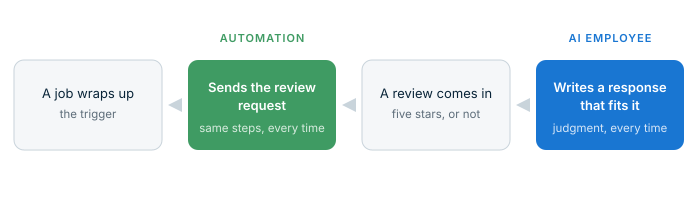

import KnowledgeCheck from "@site/src/components/KnowledgeCheck";
import CourseProgressBar from "@site/src/components/CourseProgressBar";
import SectionFeedback from "@site/src/components/SectionFeedback";
import InlineHighlighter from "@site/src/components/InlineHighlighter";
import MarkComplete from "@site/src/components/MarkComplete";
import LessonHeader from "@site/src/components/LessonHeader";
import LessonFooter from "@site/src/components/LessonFooter";
import LessonSection from "@site/src/components/LessonSection";

<InlineHighlighter courseId="agents-and-automations-together" site="vendasta_learn">

<CourseProgressBar courseId="agents-and-automations-together" site="vendasta_learn" />

<LessonHeader
  difficulty="Beginner"
  topics={["AI fundamentals", "Automations", "AI Workforce"]}
  time="about 6 minutes"
  pathName="AI foundations"
  step={6}
  totalSteps={6}
  outcomes={[
    "Explain the difference between an automation and an AI Employee in one sentence each",
    "Pick the right one for a given job",
    "Describe how the two hand off to each other in a real workflow",
  ]}
/>

## Two kinds of help

Workflows carry the routine; a worker stands at the judgment moments. Composing the two deliberately starts with telling them apart: the [automation](/automations) is a workflow you design, and the [AI Employee](/ai) is a worker you brief. Each deserves exactly one sentence:

- **An automation is deterministic:** the same trigger runs the same steps and produces the same result, every time.
- **An AI Employee is agentic:** it reads each situation and exercises judgment, so no two interactions are handled identically.

Determinism is a feature, not a limitation. A receipt should not be creative. A record update should not exercise judgment. When the logic is fixed, an automation executes it perfectly, instantly, and without asking for anyone's attention. And judgment is a feature that would be wasted on fixed logic: an AI Employee earns its keep where every instance is a little different.

<LessonSection>

## The sorting test

Rule-shaped or judgment-shaped: that old sorting tool is the whole decision.

- **Rule-shaped work goes to an automation.** If you can write the steps down and they never branch on judgment, you have written the automation already.
- **Judgment-shaped work goes to an AI Employee.** If every instance needs interpretation, brief a worker instead of drawing a flowchart.

Partners in the field put a sharp edge on the first half: if your automation requires manual input, it is not an automation. A workflow that pauses for a human to fill something in is a task list wearing a costume. Design automations to run start to finish on their own, and give the judgment calls to a worker built for them.

</LessonSection>

## Better together

The two systems are at their best composed, because each hands the other exactly what it lacks. Here is the composition partners deploy most, end to end:

Asking for the review is rule-shaped: every completed job gets the same request, reliably, with nobody remembering to send it. Responding to the review is judgment-shaped: a glowing five-star note and a lukewarm three-star one deserve different words, and the [AI Reputation Specialist](https://docs.businessapp.io/business-app/ai/ai-workforce/ai-reputation-specialist) writes each response to fit. One outcome, a review engine that runs itself, built from two systems doing what each does best.

The handoff runs in both directions. Automations can put AI Employees to work, and what an AI Employee does can start an automation: a lead captured in conversation can kick off a follow-up sequence the moment the chat ends. Build an automation with an employee at the end of it and you are composing, not just configuring.

:::tip Try it now
Take one client process, start to finish, and draw a line through it: which parts are rule-shaped, and which need judgment? That line is an implementation plan. The rule side becomes an automation; the judgment side becomes an AI Employee brief.
:::

<LessonSection>

## The complete picture

The full vocabulary fits in four lines:

- **Knowledge** is what an AI Employee knows: the business facts behind every answer.
- **Capabilities** are what it does: the instructions that shape its behavior, present in every conversation.
- **Tools** are how it acts: scoped doorways into the systems where work happens.
- **Automations** are how work finds it: deterministic workflows that trigger, and are triggered by, your workforce.

Every configuration screen you meet from here maps onto one of those four, and any requirement a business brings you belongs to one of them.

</LessonSection>

<SectionFeedback courseId="agents-and-automations-together" site="vendasta_learn" section="content" />

<KnowledgeCheck courseId="agents-and-automations-together" site="vendasta_learn"
  sessionSize={3}
  intro="Three quick questions on sorting work between automations and AI Employees, and on the handoff between them."
  questions={[
    {
      type: 'mcq',
      question: 'Every new client should receive the same welcome email and a task should be created for onboarding. Which is the right home for this?',
      options: [
        'An automation: fixed trigger, fixed steps, same result every time',
        'An AI Employee: each welcome deserves individual judgment',
        'A capability: it governs how the employee behaves in conversations',
        'The Knowledge Base: it is information about the onboarding process'
      ],
      correctIndex: 0,
      explanation: 'The steps never branch on judgment, so the flowchart is the solution. Determinism is a feature: the welcome goes out perfectly, every time, with nobody remembering to send it.'
    },
    {
      type: 'mcq',
      question: 'A workflow sends a quote, then waits for a staff member to type in a custom price before it can continue. What does the field test say?',
      options: [
        'It is a strong automation, because a human stays in control',
        'It is not really an automation yet: it pauses for manual input',
        'It should be split across two AI Employees instead',
        'It should be moved into the Knowledge Base as a procedure'
      ],
      correctIndex: 1,
      explanation: 'If your automation requires manual input, it is not an automation. Either the price logic becomes rules the workflow can run on its own, or the pricing judgment goes to a worker suited for judgment.'
    },
    {
      type: 'mcq',
      question: 'In the review engine, why does the automation send the request while the AI Employee writes the response?',
      options: [
        'The automation is cheaper to run than the AI Employee',
        'Reviews arrive too quickly for a workflow to keep up with',
        'Requesting is rule-shaped and responding is judgment-shaped',
        'Only AI Employees are permitted to contact customers directly'
      ],
      correctIndex: 2,
      explanation: 'Every completed job gets the same request: fixed logic, so the automation owns it. Every review deserves words that fit it: judgment, so the AI Reputation Specialist owns that.'
    },
    {
      type: 'mcq',
      question: 'An AI Employee captures a lead in a webchat conversation. What can happen next, without a person touching anything?',
      options: [
        'Nothing: conversations and automations run in separate systems',
        'The conversation continues until a staff member closes it',
        'The lead waits in a queue for manual entry into the CRM',
        'The capture can trigger an automation, like a follow-up sequence'
      ],
      correctIndex: 3,
      explanation: 'The handoff runs in both directions. Automations put employees to work, and what an employee does can start an automation the moment it happens.'
    }
  ]}
/>

<LessonFooter to="/learn/ai-workforce" pathName="AI foundations" step={6} totalSteps={6} nextPathName="Hire your first AI Employee" />

</InlineHighlighter>
<MarkComplete courseId="agents-and-automations-together" site="vendasta_learn" />
