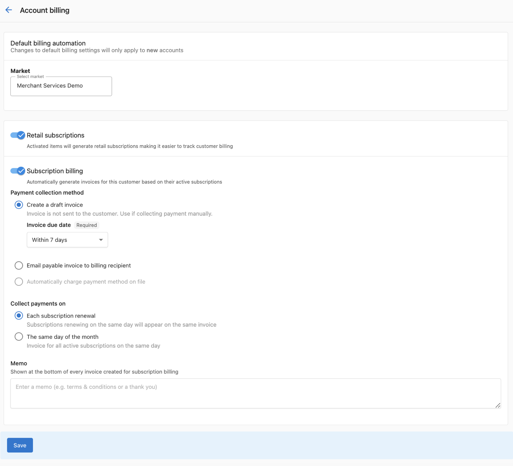

import KnowledgeCheck from "@site/src/components/KnowledgeCheck";
import { IconFlipCard, IconFlipCardGrid } from "@site/src/components/FlipCard";
import CourseProgressBar from "@site/src/components/CourseProgressBar";
import SectionFeedback from "@site/src/components/SectionFeedback";
import InlineHighlighter from "@site/src/components/InlineHighlighter";
import MarkComplete from "@site/src/components/MarkComplete";
import LessonHeader from "@site/src/components/LessonHeader";
import LessonFooter from "@site/src/components/LessonFooter";
import LessonSection from "@site/src/components/LessonSection";
import LabCallout from "@site/src/components/LabCallout";
import LabChecklist from "@site/src/components/LabChecklist";

<InlineHighlighter courseId="connect-payments-and-billing" site="vendasta_learn">

<CourseProgressBar courseId="connect-payments-and-billing" site="vendasta_learn" />

<LessonHeader
  difficulty="Beginner"
  topics={["Payments", "Partner Center"]}
  time="about 25 minutes"
  video={true}
  lab
  required={[
    "Partner Center admin access",
    "A paid subscription (Vendasta Payments is not offered on free or trial tiers)",
    "Your legal business name, business number, and a bank account for payouts",
  ]}
  pathName="Get set up"
  step={3}
  totalSteps={8}
  outcomes={[
    "Explain the wholesale-to-retail model in one sentence",
    "Choose between connecting your own Stripe account and creating one in the platform",
    "Complete the Vendasta Payments application and connect a payout account",
    "Set your default billing so renewals collect on their own",
    "Set a retail price, and read your Estimated Usage to know what you owe Vendasta",
  ]}
/>

## Two prices on every product

Getting paid runs on one relationship: you buy products from Vendasta at a wholesale price, and you sell them to your clients at the retail price you set. Every product has two prices, and the difference between them is your margin. Flip each one:

<IconFlipCardGrid>
  <IconFlipCard
    gradient="purple"
    front="Wholesale price"
    back="What Vendasta charges you while a product is active on an account. The wholesale billing frequency follows your Vendasta contract."
  />
  <IconFlipCard
    gradient="green"
    front="Retail price"
    back="What you charge your client, at the price and billing frequency you set. The Marketplace suggests a retail price; the decision is yours."
  />
</IconFlipCardGrid>

Each active product creates two matching subscriptions: a wholesale subscription from you to Vendasta, and a retail subscription from your client to you. You manage both from Partner Center.

<LessonSection>

## Choose how you collect

**Vendasta Payments** lets a client pay an order or invoice with a card inside the platform, and pays that revenue out to your bank account. It runs on Stripe, and there are two ways to set it up:

- **`Connect an existing account`.** Your Stripe account belongs to you: your transaction history, your reporting, and your negotiated Stripe rates stay yours wherever your business goes.
- **`Set up Stripe account`.** A new account created through the platform rather than under your own Stripe login. Approval typically takes one to two business days.

Processing runs at 2.9 percent plus 30 cents per credit or debit card transaction, and 1 percent per direct debit transaction, whichever route you take.

Both collect the same payments; the difference is who holds the account. Decide before your first transaction, because connecting your own Stripe account stays available only until you process a payment through a platform-created one. A pattern many partners follow is connecting their own account and treating the fee as the price of portability. You can also skip in-platform collection entirely and bill clients through whatever system you already use.

</LessonSection>

## Complete your billing contact first

Setup checks your billing details before it will let you apply, and an incomplete address is what produces the "Unsupported in Your Area" message. Two minutes here saves a confusing message later.

<LabCallout title="fill in your billing contact">
Go to `Administration` → `My billing`.

<LabChecklist
  storageKey="connect-payments-lab-1"
  steps={[
    <>Find the <strong>Billing contact</strong> card and select <code>Edit</code>. It is read-only until you do.</>,
    <>Fill in the required fields: company name, contact name, email addresses, phone number, address, country, city, and postal code.</>,
    <>Save.</>,
    <>Check that a payment method is on file. This is not required if Vendasta currently bills you by invoice.</>,
  ]}
  confirm={<>Your billing contact is complete, which is what lets the platform bill you the wholesale cost of anything you activate.</>}
/>
</LabCallout>

<LessonSection>

## Set up Vendasta Payments

{/* VIDEO: "Vendasta Payments" — Wistia ID `ayjibivt6o`, sourced from the top of docs/administration/commerce/vendasta-payments/index.mdx (Cal chose this one over the Loom setup recording), confirmed 2026-08-23. */}

Watch how Vendasta Payments works before you start the application:

  

    <iframe
      src="https://fast.wistia.net/embed/iframe/ayjibivt6o?web_component=true&seo=true"
      title="Vendasta Payments overview"
      allow="autoplay; fullscreen"
      allowTransparency
      frameBorder="0"
      scrolling="no"
      className="wistia_embed"
      name="wistia_embed"
      width="100%"
      height="100%"
    ></iframe>
  

The application is a Stripe identity check, so it goes fastest with your details in front of you: your **legal business name** exactly as it appears on your tax ID, your **business number** (EIN in the US, CRA business number in Canada), your **operating name** if you trade under a different one, your **registered business address** (a home address works if you do not have one), and the **account representative's** legal name, home address, and government ID.

Two things on that page are yours to set rather than Stripe's, and both are easy to miss. The **`Account statement description`** is how charges appear on your customers' statements: replace the default with your own business name. And **`Receiving bank account`** is an in-platform form asking for the country, currency, transit number, institution number, and account number your payouts land in, so have those details to hand.

This is the one part of setting up that is not a five-minute job, and it is not worth pretending otherwise: it runs across several Stripe screens, it asks for government ID, and approval typically takes one to two business days. Work through it with [the Vendasta Payments guide](/administration/commerce/vendasta-payments/) open beside you, which covers every field in order.

Once you are approved, payments your clients make appear under `Commerce` → `Payments`. Stripe holds your first payments for up to a week, then pays out on a seven-day rolling basis into the account you just added. The full field-by-field detail is in [the Vendasta Payments guide](/administration/commerce/vendasta-payments/).

</LessonSection>

## Set billing to collect on its own

Default billing settings decide what happens on every renewal, and they apply automatically to each new account you create. Set this once and collection is handled from then on.

<LabCallout title="turn on default billing automation">
Go to `Administration` → `Default billing settings`.

<LabChecklist
  storageKey="connect-payments-lab-3"
  steps={[
    <>Turn the <code>Subscriptions</code> toggle on. It is off by default, and it is what tracks and collects payment on each renewal.</>,
    <>Set <code>Payment collection</code>: how you take the money.</>,
    <>Set <code>Subscription renewal</code>: <code>Do nothing</code> leaves renewals alone, <code>Create a draft invoice</code> raises an invoice you send yourself.</>,
    <>Set <code>Subscription scheduling</code>: renew on each subscription's own start date, or put every new subscription on one shared day of the month.</>,
    <>Read the <strong>Billing summary</strong> panel on the right, then select <code>Save</code>.</>,
  ]}
  confirm={<>Every account you create from now on starts with collection handled, without you configuring it each time.</>}
/>
</LabCallout>

The page carries a `Memo` field as well, which prints at the bottom of every invoice subscription billing creates. And one limit worth knowing, which the page states in a banner of its own: this applies to accounts created after you save. Accounts that already exist keep their current settings, and any single account can be switched from its own billing settings under `Accounts` → `Manage Accounts`. [This guide covers the options](/administration/commerce/default-billing-settings/).

<LessonSection>

## Set your retail prices

Pricing is yours to control, and automation depends on it. Without a retail price on an edition, the automation has no amount to calculate, so this is not an optional polish step.

The Products screen shows your suggested retail price. Your **wholesale cost** lives elsewhere: `Marketplace` → `Discover Products` carries `Your cost` columns beside the vendor's suggested retail, which is where you check margin before you set a number.

<LabCallout title="price one product">
Go to `Marketplace` → `Products`.

<LabChecklist
  storageKey="connect-payments-lab-4"
  steps={[
    <>Open a product you intend to sell, and select its <code>Product info</code> tab.</>,
    <>Under <strong>Product settings</strong>, find <strong>Retail price</strong> and expand the edition you sell. Products are priced per edition, not once.</>,
    <>Select <code>Edit</code>, then set the retail price and <code>Billing period</code> that fit your market.</>,
    <>Save, and repeat for anything else you plan to activate soon.</>,
  ]}
  confirm={<>At least one edition carries your retail price, which is the number automatic collection will invoice against.</>}
/>
</LabCallout>

One fact keeps your numbers clean: a catalog price change applies to new subscriptions from then on. Existing clients keep the price they signed up at unless you edit their subscription directly, and an edit takes effect on the next billing cycle. [This guide covers subscription management](/commerce/subscriptions/subscription-management).

</LessonSection>

## Check what you owe each month

One tab answers "what am I on track to pay Vendasta this month?" It is an estimate, broken down per product rather than totalled in one number.

<LabCallout title="read your Estimated Usage">
Go to `Administration` → `My billing` → `Estimated Usage`.

<LabChecklist
  storageKey="connect-payments-lab-5"
  steps={[
    <>Read the table: <code>Products</code>, <code>Units</code>, <code>Gross Total</code>, <code>Discounts</code>, <code>Net Total</code>, estimated for the current month. It pages, so work through it rather than expecting one figure at the bottom.</>,
    <>Open the <code>Active subscriptions</code> tab, three along from Estimated Usage, to see which products are in the current cycle and when any of them expire.</>,
  ]}
  confirm={<>You know what is driving this month's wholesale cost and which subscriptions are behind it, which together are your monthly billing check.</>}
/>
</LabCallout>

<SectionFeedback courseId="connect-payments-and-billing" site="vendasta_learn" section="content" />

<KnowledgeCheck courseId="connect-payments-and-billing" site="vendasta_learn"
  sessionSize={3}
  intro="Three quick questions on the two prices, the Stripe decision, and where the money shows up."
  questions={[
    {
      type: 'mcq',
      question: 'You set a product\'s retail price at $200 and your wholesale cost is $120. A client activates it. What is your position?',
      options: [
        'You owe Vendasta $200 for the activation',
        'You earn $80 of margin on that subscription',
        'The client pays Vendasta directly and you are not involved',
        'You earn $200 and pay no wholesale cost'
      ],
      correctIndex: 1,
      explanation: 'Vendasta charges you the $120 wholesale price; your client pays the $200 retail price you set; the $80 difference is your margin.'
    },
    {
      type: 'mcq',
      question: 'You already run a Stripe account with years of history and negotiated rates. What does connecting it to Vendasta Payments mean for you?',
      options: [
        'Your account, history, and rates stay yours, and a 0.75 percent platform fee applies per transaction',
        'Your Stripe rates are replaced by the platform\'s standard processing rates',
        'Your history transfers into the platform and can no longer be viewed in Stripe',
        'Nothing changes at all, and no fees apply beyond your existing Stripe fees'
      ],
      correctIndex: 0,
      explanation: 'A connected Stripe account remains yours: your history, reporting, and negotiated rates are untouched. The platform adds a 0.75 percent fee per transaction on top of your Stripe fees.'
    },
    {
      type: 'mcq',
      question: 'You turned on default billing automation this morning. Which accounts does it apply to?',
      options: [
        'Accounts you create from now on; existing accounts keep their current settings',
        'Every account you have, immediately',
        'Only accounts in the market you had selected',
        'None until each client approves the change'
      ],
      correctIndex: 0,
      explanation: 'Defaults apply to accounts created after you save. Any existing account can still be switched individually from its own billing settings.'
    },
    {
      type: 'mcq',
      question: 'Your billing automation is on, but one product is not being invoiced. What is the likely cause?',
      options: [
        'That product has no retail price set, so there is no amount to calculate',
        'The client has not logged in to Business App yet',
        'Automation only bills products activated this month',
        'The wholesale price has not been confirmed by Vendasta'
      ],
      correctIndex: 0,
      explanation: 'Automatic collection calculates each invoice from your retail prices. A product without one gives the automation nothing to bill against.'
    },
    {
      type: 'mcq',
      question: 'You raise a product\'s retail price from $150 to $180. What happens to a client who bought it last month at $150?',
      options: [
        'They are re-billed at $180 on their next renewal',
        'Their subscription is canceled and must be repurchased',
        'They keep the $150 price they signed up at',
        'They are refunded the difference automatically'
      ],
      correctIndex: 2,
      explanation: 'A catalog price change does not automatically update existing active subscriptions; new subscriptions pick up the new price, and you can apply it to an existing client by editing their subscription directly.'
    },
    {
      type: 'mcq',
      question: 'You want to know what you will owe Vendasta at the end of this month. Where do you look?',
      options: [
        'Commerce → Payments',
        'The Marketplace product page',
        'The client\'s Business App billing tab',
        'Administration → My billing → Estimated Usage'
      ],
      correctIndex: 3,
      explanation: 'Estimated Usage shows your month-end total based on currently active products. Commerce → Payments is where client revenue arrives.'
    }
  ]}
/>

<LessonFooter to="/learn/getting-started/brand-it" pathName="Get set up" step={3} totalSteps={8} />

</InlineHighlighter>
<MarkComplete courseId="connect-payments-and-billing" site="vendasta_learn" />
