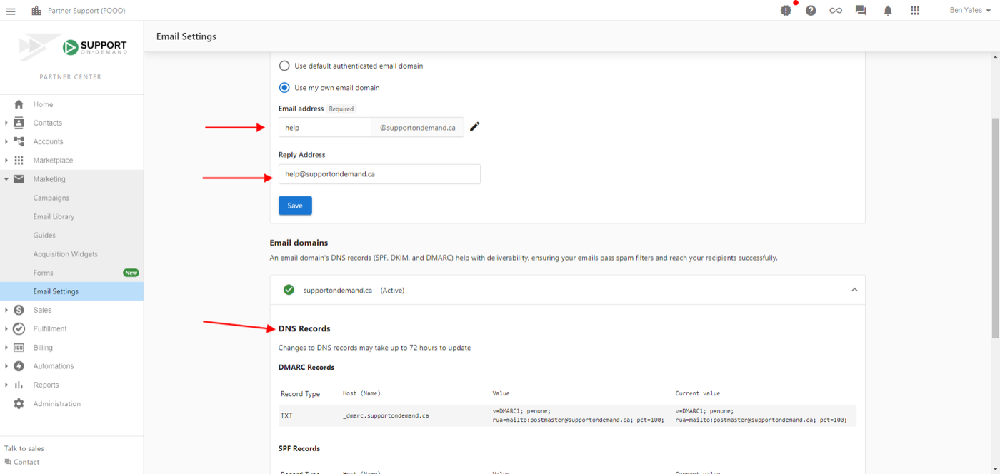

import KnowledgeCheck from "@site/src/components/KnowledgeCheck";
import CourseProgressBar from "@site/src/components/CourseProgressBar";
import SectionFeedback from "@site/src/components/SectionFeedback";
import InlineHighlighter from "@site/src/components/InlineHighlighter";
import MarkComplete from "@site/src/components/MarkComplete";
import LessonHeader from "@site/src/components/LessonHeader";
import LessonFooter from "@site/src/components/LessonFooter";
import LessonSection from "@site/src/components/LessonSection";
import LabCallout from "@site/src/components/LabCallout";
import LabChecklist from "@site/src/components/LabChecklist";

<InlineHighlighter courseId="connect-your-domain-and-email" site="vendasta_learn">

<CourseProgressBar courseId="connect-your-domain-and-email" site="vendasta_learn" />

<LessonHeader
  difficulty="Beginner"
  topics={["Email domain", "Partner Center"]}
  time="about 20 minutes"
  lab
  required={[
    "Partner Center admin access",
    "An email address on your own domain",
    "Access to your domain's DNS settings",
  ]}
  pathName="Get set up"
  step={2}
  totalSteps={7}
  outcomes={[
    "Set the sender name and address every platform email goes out under",
    "Generate your SPF, DKIM, and DMARC records and add them at your DNS host",
    "Confirm each record validated, and switch your sending over to your domain",
    "Add the mailing address that keeps your campaigns compliant",
  ]}
/>

## What your domain unlocks

Connecting your email domain once means every email the platform sends arrives from your business, with your name in the sender line. A Snapshot Report to a prospect, an order waiting for a client's approval, a welcome email to a new Business App user, a marketing campaign: all of it follows the same rule.

Before you connect, platform email sends from a shared Vendasta domain. This is the setup task with the widest reach, because nearly everything you do in the platform produces email at some point. It is also what keeps you out of spam folders. An authenticated domain, a complete business address, and the CAN-SPAM basics on every campaign are the three legs of deliverability, and this step sets up the first two.

One requirement before you start: your sending address has to live on a domain you own, such as hello@yourbusiness.com. Addresses from free providers like Gmail or Yahoo cannot be authenticated, because authentication records can only be added to a domain you control. If you do not own a domain yet, your own Marketplace carries domain products, and any registrar can sell you one in minutes.

<LessonSection>

## Set your sender identity and generate your records

Three cards stack on this one page: **Sender and reply settings**, **Advanced email settings**, and **Email domains**. Work down them in order, and note that the first two cards each have their own `Save`.

One scope note the page states plainly: these settings drive Campaigns and other integrated services. Emails sent through Conversations are not affected by them.

<LabCallout title="set the sender, then start the domain">
Go to `Marketing` → `Email settings`.

<LabChecklist
  storageKey="connect-domain-lab-1"
  steps={[
    <>On the <strong>Sender and reply settings</strong> card, set the <strong>Sender name</strong>. Your business name is the strong choice, because everyone on your team who sends from the platform sends under it.</>,
    <>Set the <strong>Reply Address</strong>, then <code>Save</code> on that card.</>,
    <>Move down to <strong>Advanced email settings</strong> and choose <code>Use my own email domain</code> under <strong>Sender domain</strong>.</>,
    <>Set the <strong>Email address</strong> you want to send from, then <code>Save</code> on that card. The page has one Save per card, so both need pressing.</>,
    <>Open the <strong>Email domains</strong> section below. Your domain lists the DNS records the platform generated for it.</>,
  ]}
  confirm={<>Your sender name and reply address are saved, your own domain is selected, and the generated records are on screen waiting to be copied.</>}
/>
</LabCallout>

One thing worth knowing about the sender: when a salesperson is assigned to an account, the platform uses that salesperson's name and email instead, so prospects always hear from the person they already know.

</LessonSection>

## Add the records at your DNS host

The platform generates four records: one DMARC and one SPF as TXT records, and two DKIM records as CNAMEs. Receiving mail servers check them on every incoming message to confirm that email from your domain is legitimate, and until they are in place at your DNS host, nothing changes.

<LabCallout title="copy the four records across">
Go to the service that hosts your DNS: Google Workspace, GoDaddy, Cloudflare, Namecheap, or whoever you bought the domain from.

<LabChecklist
  storageKey="connect-domain-lab-2"
  steps={[
    <>Open your DNS management screen in a second tab, beside the Email settings page.</>,
    <>Work down the table in the order it lists them, copying each <strong>Host (Name)</strong> and <strong>Value</strong> exactly.</>,
    <>Add the <strong>DMARC</strong> record (TXT), then the <strong>SPF</strong> record (TXT).</>,
    <>Add both <strong>DKIM</strong> records (CNAME). There are two of them, and both are needed.</>,
    <>For SPF, check whether your domain already has one. A domain carries only one SPF record, so if there is an existing line, add the platform's include value into that line rather than creating a second record.</>,
  ]}
  confirm={<>All four records exist at your DNS host, and there is exactly one SPF line on the domain.</>}
/>
</LabCallout>

If your DNS lives with GoDaddy or Namecheap, [these guides walk through the exact screens](/marketing/email-settings/email-authentication/).

<LessonSection>

## Confirm it verified, then switch over

DNS changes do not take effect the moment you save them. The page says so itself: changes to DNS records may take up to 72 hours to update. That wait is normal, and selecting the domain as your sending address is what actually moves your email across.

<LabCallout title="check the marks, then choose your domain">
Go back to `Marketing` → `Email settings`.

<LabChecklist
  storageKey="connect-domain-lab-3"
  steps={[
    <>Expand your domain in <strong>Email domains</strong> and read the <strong>Current value</strong> column. It shows the value found at your DNS host, or <code>Not found</code> in red.</>,
    <>Fix anything reading <code>Not found</code> at your DNS host, and check again later in the day.</>,
    <>Watch the domain's own row header. It carries the overall status, and a <strong>Domain authorization required</strong> banner until every record lands.</>,
    <>Once the domain is authorized, set your <strong>Email address</strong> under <strong>Advanced email settings</strong> to that domain, and <code>Save</code> that card.</>,
  ]}
  confirm={<>The domain shows as active and your sending address sits on it. From this moment, everything the platform sends carries your domain.</>}
/>
</LabCallout>

For a walkthrough of each validation, [this guide covers updating email settings](/marketing/email-settings/update-email-settings).

</LessonSection>

## The address at the bottom

One more field completes the compliance picture. Commercial email must include your physical mailing address, and the platform prints it in the footer of what you send.

<LabCallout title="add your mailing address">
Go to `Administration` → `Customize` → `Partner Defaults`.

<LabChecklist
  storageKey="connect-domain-lab-4"
  steps={[
    <>Open the <strong>Partner defaults</strong> tab, then expand the <strong>Email Settings</strong> accordion. The page opens with every section collapsed, so nothing is visible until you do.</>,
    <>Scroll to <strong>Required contact information for campaigns</strong>.</>,
    <>Fill in <code>Address</code>, <code>City</code>, <code>Country</code>, state or province, and <code>Zip / Postal Code</code>.</>,
    <>Save.</>,
  ]}
  confirm={<>Your address is stored, and every campaign you send from here carries a compliant footer.</>}
/>
</LabCallout>

One requirement catches teams later, so it is worth knowing now: every user who sends email from the platform needs a verified email address. Yours verifies during signup, and as you add teammates, [the verification guide covers theirs](/administration/my-account/my-team/email-verification). [The requirements guide lists the full set](/marketing/email-settings/email-settings-requirements).

<SectionFeedback courseId="connect-your-domain-and-email" site="vendasta_learn" section="content" />

<KnowledgeCheck courseId="connect-your-domain-and-email" site="vendasta_learn"
  sessionSize={3}
  intro="Three quick questions on what the domain connection covers, the records themselves, and reading the validation screen."
  questions={[
    {
      type: 'mcq',
      question: 'You connected your email domain this morning. Which of these now sends from your own domain?',
      options: [
        'Every email sent from the platform: Snapshot Reports, orders, welcome emails, and campaigns',
        'Marketing campaigns only, because the setting lives under Marketing',
        'Welcome emails only, because those are the emails clients see first',
        'Only emails you write by hand from inside the CRM'
      ],
      correctIndex: 0,
      explanation: 'The domain connection covers every email sent from the platform. The setting lives under Marketing, and its reach is platform-wide.'
    },
    {
      type: 'mcq',
      question: 'You added the generated records at your DNS host, but the SPF line keeps showing as invalid. Your domain already had an SPF record before today. What is the likely fix?',
      options: [
        'Merge the platform\'s include value into your existing SPF record, because a domain carries only one',
        'Delete the DKIM records, because they conflict with SPF on the same domain',
        'Wait a full week, because SPF records always propagate more slowly than others',
        'Re-enter the record at your domain registrar instead of your DNS host'
      ],
      correctIndex: 0,
      explanation: 'A domain carries a single SPF record. When one already exists, add the platform\'s include value into that line instead of creating a second record.'
    },
    {
      type: 'mcq',
      question: 'Every DNS record on your domain resolves and the domain shows as authorized, and platform email still sends from the shared Vendasta domain. What was missed?',
      options: [
        'Setting the Email address under Advanced email settings to that domain, and saving that card',
        'Waiting a mandatory 48 hours after validation before sending begins',
        'Adding a second SPF record to confirm the first one',
        'Registering the domain with each mail provider individually'
      ],
      correctIndex: 0,
      explanation: 'Validation proves the records are correct. Pointing your sending address at the authorized domain, and saving that card, is what actually moves your email across.'
    },
    {
      type: 'truefalse',
      statement: 'A Gmail address works as your platform sending address as long as you verify it.',
      correct: false,
      explanation: 'Authentication records can only be added to a domain you own. Free provider addresses like Gmail or Yahoo cannot be authenticated, which is why the sending address lives on your own domain.'
    },
    {
      type: 'mcq',
      question: 'Your records went in an hour ago and two are still showing as pending. What is the right response?',
      options: [
        'Wait. Propagation can take up to 48 hours and validation can show pending for up to 72',
        'Delete them and add them again more carefully',
        'Contact your DNS provider, since an hour is already too long',
        'Switch the sender back to the shared domain permanently'
      ],
      correctIndex: 0,
      explanation: 'Records often confirm the same day, but DNS changes propagate on their own schedule. Pending inside that window is normal rather than a problem to fix.'
    }
  ]}
/>

<LessonFooter to="/learn/getting-started/connect-payments-and-billing" pathName="Get set up" step={2} totalSteps={7} />

</InlineHighlighter>
<MarkComplete courseId="connect-your-domain-and-email" site="vendasta_learn" />
