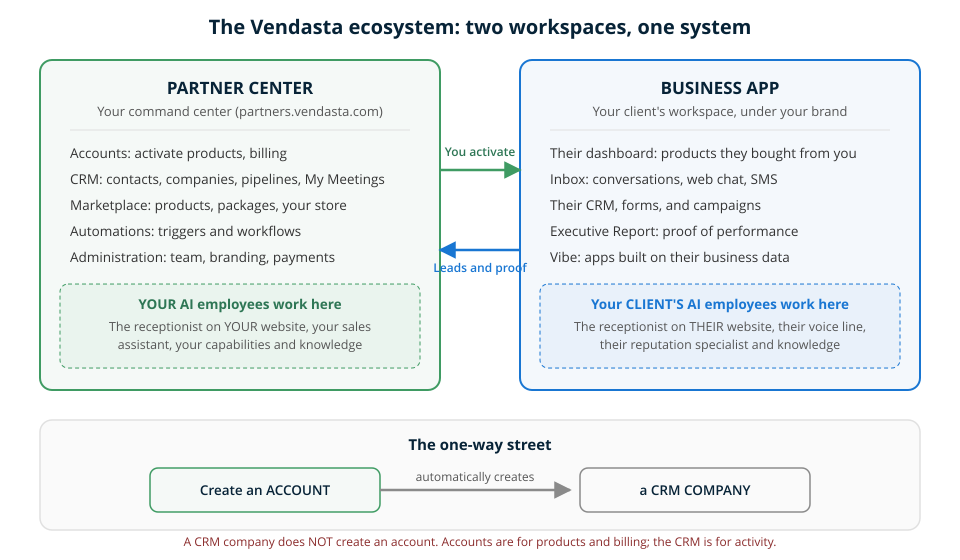

import KnowledgeCheck from "@site/src/components/KnowledgeCheck";
import CourseProgressBar from "@site/src/components/CourseProgressBar";
import SectionFeedback from "@site/src/components/SectionFeedback";
import InlineHighlighter from "@site/src/components/InlineHighlighter";
import MarkComplete from "@site/src/components/MarkComplete";

<InlineHighlighter courseId="ecosystem-map" site="vendasta_learn">

<CourseProgressBar courseId="ecosystem-map" site="vendasta_learn" />

The single most common request we hear from partners, in exactly these words: "I would love a visual of the workflow of how it all connects." This lesson is that visual, plus the three rules that make it stick.

:::info Before you start
**Difficulty:** Beginner &nbsp;|&nbsp; **Time:** about 12 minutes &nbsp;|&nbsp; **Prerequisite:** [The Vendasta story](/learn/getting-started/the-vendasta-story)
:::

:::tip What you'll be able to do
- Say which workspace any task belongs to: Partner Center or Business App
- Explain how accounts and CRM companies relate (and why it only works one way)
- Point to where an AI Employee lives, and why that matters before you configure one
:::

## One map, two workspaces

Everything in the platform happens in one of two places. You work in **Partner Center**. Your clients work in **Business App**, under your brand. Every confusing moment in the platform gets simpler when you ask one question first: whose workspace am I in?

**Partner Center** is your command center. It is where you manage [accounts](/accounts), run your own [CRM](/crm) and pipeline, build packages in the [Marketplace](/marketplace), set up [automations](/automations), and administer your team, brand, and payments.

**Business App** is what your clients see: their dashboard, their inbox, their reports, and the products you activated for them. It carries your brand everywhere. Learn the product side in the [Business App documentation](/business-app).

Two flows connect the workspaces. Products and access flow from you to your clients (you activate, they receive). Leads, activity, and proof of performance flow back from their world into yours.

## The one-way street: accounts and CRM companies

This is the rule that trips up the most people, so here it is plainly.

When you **create an account**, the platform automatically creates a matching **CRM company** for you. When you create a CRM company, the platform does **not** create an account. It is a one-way street.

Use each one for what it is built for:

| | Account | CRM company |
|---|---|---|
| **Built for** | Activating products, billing, giving users access to Business App | Logging activity: calls, notes, deals, follow-ups |
| **Think of it as** | The business's service record with you | Your sales team's working file on them |
| **Where** | Accounts → Manage accounts | CRM → Companies |

Practical consequence: when you are prospecting, work in the CRM. The moment someone is ready to receive products, create the account (the CRM side comes along automatically). The full how-to lives in the [accounts documentation](/accounts).

## Where AI Employees live

Here is a true story from a partner call. An agency built a chat receptionist, tested it carefully, and then discovered it never appeared on their client's website. Nothing was broken. The receptionist had been built in the wrong workspace.

The rule: **AI Employees belong to the workspace that owns the website they serve.**

- **Your** AI Employees live in your Partner Center: the receptionist answering your agency's website, your own sales assistant, your capabilities and knowledge.
- **Your client's** AI Employees live in their Business App: the receptionist on their site, their voice line, their reputation specialist, powered by their business knowledge.

Configure in the right workspace first and everything downstream (channels, knowledge, conversations, leads) lands where you expect. The [AI documentation](/ai) covers the configuration itself.

## Products, AI Employees, and automations

Three words that get used interchangeably and should not be:

| | What it is | Where it lives | Example |
|---|---|---|---|
| **Product** | Something you activate on an account, at wholesale, and resell | Marketplace → the account | Local SEO, Conversations AI |
| **AI Employee** | A worker you configure with knowledge and capabilities | Partner Center or Business App (see above) | AI Receptionist, AI Sales Assistant |
| **Automation** | A trigger-and-action workflow that runs on its own | Automations, in either workspace | New form submission sends a follow-up task |

They compose: a product often unlocks an AI Employee, and automations carry work between them. That composition is the whole "AI does the work, you orchestrate" model in miniature.

## A map that stays true

The platform is consolidating over time, and some things that live in Partner Center today will move closer to Business App. This map names what things **are**, which stays true even as menus move: your command center, your client's branded workspace, the one-way street, and the ownership rule for AI Employees.

<SectionFeedback courseId="ecosystem-map" site="vendasta_learn" section="content" />

## Check your map

<KnowledgeCheck
  sessionSize={3}
  questions={[
    {
      type: 'mcq',
      question: 'Your client wants a chatbot on their website. Where do you configure that AI Employee?',
      options: [
        'Your Partner Center, under AI',
        'Their Business App, under AI',
        'The Marketplace',
        'Either workspace works the same way'
      ],
      correctIndex: 1,
      explanation: 'AI Employees belong to the workspace that owns the website they serve. A client-facing receptionist is configured in that client\'s Business App.'
    },
    {
      type: 'mcq',
      question: 'You created a company in the CRM last week. Today the client is ready to buy. What do you do?',
      options: [
        'Nothing, the account already exists',
        'Create an account; the CRM company is already covered',
        'Delete the company and start over with an account',
        'Convert the company using the upgrade button'
      ],
      correctIndex: 1,
      explanation: 'Companies never become accounts on their own. Create the account when the client is ready to receive products; account creation is the one-way street that keeps CRM and accounts in sync going forward.'
    },
    {
      type: 'mcq',
      question: 'You want a follow-up task created automatically every time a new lead comes in. Which building block is that?',
      options: [
        'A product',
        'An AI Employee',
        'An automation',
        'A package'
      ],
      correctIndex: 2,
      explanation: 'Trigger-and-action workflows are automations. Products are things you activate and resell; AI Employees are workers you configure with knowledge and capabilities.'
    }
  ]}
/>

---

Now that you can see the whole board, let's walk your side of it. Next: [Partner Center walkthrough](/learn/getting-started/partner-center-walkthrough).

</InlineHighlighter>
<MarkComplete courseId="ecosystem-map" site="vendasta_learn" />
