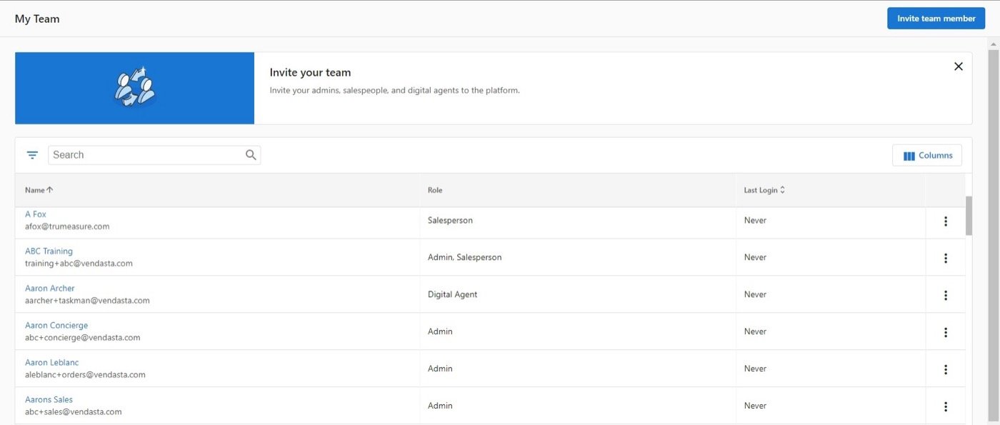
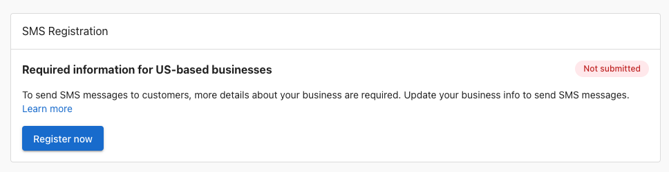

import KnowledgeCheck from "@site/src/components/KnowledgeCheck";
import { IconFlipCard, IconFlipCardGrid } from "@site/src/components/FlipCard";
import CourseProgressBar from "@site/src/components/CourseProgressBar";
import SectionFeedback from "@site/src/components/SectionFeedback";
import InlineHighlighter from "@site/src/components/InlineHighlighter";
import MarkComplete from "@site/src/components/MarkComplete";
import LessonHeader from "@site/src/components/LessonHeader";
import LessonFooter from "@site/src/components/LessonFooter";
import LessonSection from "@site/src/components/LessonSection";
import LabCallout from "@site/src/components/LabCallout";
import LabChecklist from "@site/src/components/LabChecklist";
import KeyPoints from "@site/src/components/KeyPoints";
import aiReceptionistFace from './img/ai-receptionist-face.png';
import aiReputationSpecialistFace from './img/ai-reputation-specialist-face.png';

<InlineHighlighter courseId="the-vendasta-platform" site="vendasta_learn">

<CourseProgressBar courseId="the-vendasta-platform" site="vendasta_learn" />

<LessonHeader
  difficulty="Beginner"
  topics={["Partner Center", "Business App", "AI Workforce"]}
  time="about 12 minutes"
  lab
  required={["Partner Center admin access"]}
  pathName="Get set up"
  step={1}
  totalSteps={8}
  outcomes={[
    "Describe the mental model for the platform: AI does the work, you orchestrate",
    "Name what the platform gives you beyond products: the CRM, Vendasta Services, and billing",
    "Say which workspace any task belongs to: Partner Center or Business App",
    "Place any AI Employee in the workspace it belongs to, before you configure it",
    "Give each person on your team the right view of Partner Center",
  ]}
/>

## Your mental model for the platform

The platform is built around one idea: **AI does the work, you orchestrate.** AI Employees answer calls and messages, capture leads, and book appointments. Automations move work between them. You configure, supervise, and sell the outcomes. That changes what your time is spent on: less of the repetitive work itself, more running the system that does it.

That sentence used three building blocks, and everything in the platform is made of them. Flip each one:

<IconFlipCardGrid>
  <IconFlipCard
    gradient="blue"
    front="Product"
    back="What you shop for in the Marketplace and resell, like Local SEO, Social AI, or Conversations AI. You activate it on an account, and it is what your client is billed for."
  />
  <IconFlipCard
    gradient="green"
    front="AI Employee"
    back="The worker a product turns on. You will not find one for sale in the Marketplace on its own: you sell the product, and the employee is what it unlocks. You configure it with knowledge and capabilities in the workspace it serves."
  />
  <IconFlipCard
    gradient="purple"
    front="Automation"
    back="A trigger-and-action workflow that runs on its own, often paired with an AI Employee so its work goes somewhere: the AI Receptionist captures a lead, and an automation sends the welcome email and creates the follow-up task."
  />
</IconFlipCardGrid>

Together they form one chain: you sell the product, the AI Employee it unlocks does the work, and an automation acts on that work for you. The receptionist captures the lead; the automation sends the welcome email. That chain is "AI does the work, you orchestrate" in action.

And everything you run can be white label: the platform, the products you resell, and the services that fulfill them carry your brand, at the retail prices you set, so your clients see your name throughout. White label depends on your subscription plan, and making all of that yours is its own step later in this path.

<LessonSection>

## One platform to run your business

The building blocks do the work; the toolkit around them runs the business. With Vendasta you get the full infrastructure: client management, a catalog of products to resell, automation, billing, and a fulfillment team, all under your own brand. You do not have to use all of it right away. Most partners get one AI Employee running for a client, or lead with a single package that bundles the products a vertical needs, and grow into the rest from there.

Alongside the products you resell, three pieces of that toolkit carry the day-to-day:

**Manage your clients in the [CRM](/crm).** Contacts, companies, pipeline, and tasks, with every client conversation in one place, inside Partner Center.

**Sell services you do not deliver yourself with [Vendasta Services](/vendasta-services).** A fulfillment team for websites, advertising management, social media, content, and more. Vendasta's experts deliver under your brand, so you can say yes to a bigger scope without hiring.

**Bill and get paid in [Commerce](/commerce).** Orders, invoices, subscriptions, and payments in one place: you set the retail price, billing runs on your schedule, and payouts land in your bank account.

</LessonSection>

## Partner Center versus Business App

**Partner Center** is where you run your business and build your own AI workforce; **Business App** is where you build the AI workforce for each of your clients. One question orients you anywhere in the platform: whose workspace am I in?

The two workspaces stay connected. Products you activate in Partner Center appear in your client's Business App. Everything their business generates after that (leads, conversations, reviews, results) lands in their Business App, where you have full visibility. The Executive Report turns those results into proof of your value, delivered to them under your brand.

:::tip Try it now
Not sure whose workspace you are in? Look at the top left: the navigation is labeled `Partner Center` or `Business App`. That one glance answers "whose workspace am I in?" anywhere in the platform.
:::

<LessonSection>

## What you set up in each

Here is how the split plays out in practice, side by side:

| | Partner Center (yours) | Business App (each client's) |
|---|---|---|
| **Brand** | Upload your logo once; it brands both workspaces | Carries your brand automatically |
| **People** | Invite your team, set permissions, and fill in salesperson profiles | Add client users and send the welcome email once their products are live |
| **Email** | Connect your email domain so everything the platform sends comes from you | Their notifications and reports send under your brand |
| **Payments** | Connect payments and set your billing defaults | Their orders, subscriptions, and invoices live on their account |
| **AI Employees** | Your receptionist and sales assistant; serving your business | Their receptionist and specialists; serving their business |
| **Calendars** | Connect your calendar in My Meetings so booking works everywhere | Their meeting scheduler, once they have Conversations AI |
| **Products** | Choose what to sell and build packages in the Marketplace | Every product you activate appears as a dashboard for them |

Each row on this table becomes hands-on later in this learning path; for now, the pattern is the takeaway. Set yourself up once on the left, then repeat the client side of the ritual for every business you bring on.

</LessonSection>

## Two ways your team sees Partner Center

Your team works in Partner Center, and each person's role decides how much of it they see. An **Admin** gets the full workspace: accounts, billing, branding, and administration, the right fit for decision-makers, managers, and operations. A **Salesperson** gets a focused view: Opportunities and My Meetings in Partner Center, for pipeline and client communication. (A third role, **Digital Agent**, sees only Task Manager rather than Partner Center; it belongs to fulfillment work later on.) Running solo? You are the Admin, and the CRM view is where your selling happens.

Permissions go finer than the two roles. You can restrict an Admin from specific areas, such as billing reports, platform customization, or creating other Admins. Most people on your team should hold at least some admin access, because permissions can narrow it afterward; defaulting everyone to Salesperson just to limit access gives them less than they need.

<LabCallout title="see your team, and add one person">
Go to `Administration` → `My team`.

<LabChecklist
  storageKey="the-vendasta-platform-lab-1"
  steps={[
    <>Read the banner at the top. It names how many seats your plan includes and what an additional seat costs per month.</>,
    <>Look at the list. Every person shows their role in the <strong>Role</strong> column: Admin, Salesperson, or Digital Agent.</>,
    <>Select <code>Invite team member</code> in the upper right.</>,
    <>Enter their first name, last name, and email.</>,
    <>Tick the roles they need. They are checkboxes, so one person can hold more than one.</>,
    <>Select <code>Send</code>.</>,
  ]}
  confirm={<>The person appears on My team with their roles beside their name, and a welcome email is on its way to them with a link to set a password.</>}
/>
</LabCallout>

Permissions and market access are set after the person exists, not in the invite panel. Working solo today? Open `My team` anyway and read your own row. Knowing where roles live is what makes the first hire a two-minute job instead of a search. [This guide covers every role and permission in full](/getting-started/getting-started-guides/getting-started-with-your-team).

<LessonSection>

## The boundary in practice

Two placements follow the whose-workspace rule and are worth knowing before they come up.

**SMS registration lives with the client.** United States carriers require a business to register before it sends SMS messages (the registration is called A2P, application-to-person). The registration belongs to the business sending the texts, so it happens in that client's Business App, under `Administration` → `Conversation`. [This guide covers the registration](/business-app/conversations/sms/us-businesses-sms-registration).

**A CRM contact is not a Business App user.** A contact is someone you are talking to: a record in your CRM. A user is someone you have invited into Business App, where they can log in and use their tools. Contacts never become users on their own; you create the user and send the welcome email when their products are ready for them.

</LessonSection>

## Where AI Employees live

Every AI Employee has a home base, and the rule for finding it is simple: **an AI Employee lives in the workspace of the business it serves.**

<KeyPoints
  items={[
    {
      img: aiReceptionistFace,
      title: 'Your AI Employees',
      text: 'Live in your Partner Center: the receptionist answering for your agency, your sales assistant, your capabilities and knowledge.',
    },
    {
      img: aiReputationSpecialistFace,
      title: "A client's AI Employees",
      text: 'Live in their Business App: their receptionist, their voice line, their reputation specialist, powered by their business knowledge.',
    },
  ]}
/>

Pick the workspace first and everything downstream lands where you expect: channels, knowledge, conversations, and leads. Remember how they arrive: you sell products, and the AI Employee is what the product unlocks; there is no employee for sale on its own. When you are ready to configure one, [this guide will help](/ai).

<SectionFeedback courseId="the-vendasta-platform" site="vendasta_learn" section="content" />

<KnowledgeCheck courseId="the-vendasta-platform" site="vendasta_learn"
  sessionSize={3}
  intro="Three quick questions on the model, the two workspaces, and where things happen for you versus for a client."
  questions={[
    {
      type: 'mcq',
      question: 'You resell a product from the Marketplace to a client. What does the client see on it?',
      options: [
        'Your brand and the retail price you set',
        'The Vendasta brand and wholesale price',
        'The original vendor\'s brand and pricing',
        'No branding until they upgrade'
      ],
      correctIndex: 0,
      explanation: 'White-label means the platform and the products you resell carry your brand, at the retail prices you set. Vendasta provides the software; you provide the brand and the relationship.'
    },
    {
      type: 'mcq',
      question: 'A client signs for a website build, and you have no web team of your own. How do you deliver it?',
      options: [
        'Order it through Vendasta Services; the team delivers under your brand',
        'Decline the work, since the platform only resells software products',
        'Ask Vendasta Support to assign the project to your account manager',
        'Have the client purchase the build from Vendasta directly'
      ],
      correctIndex: 0,
      explanation: 'Vendasta Services is the fulfillment team behind work you sell but do not deliver yourself: websites, advertising management, social media, content, and more, delivered under your brand.'
    },
    {
      type: 'mcq',
      question: 'Where do you log in to run your business on the platform?',
      options: [
        'Business App, from your client\'s welcome email',
        'Vendor Center, from the Marketplace',
        'The Executive Report',
        'Partner Center, at partners.vendasta.com'
      ],
      correctIndex: 3,
      explanation: 'Partner Center at partners.vendasta.com is your workspace. Business App is where your clients work, under your brand.'
    },
    {
      type: 'mcq',
      question: 'Your client wants a chatbot on their website. Where do you configure that AI Employee?',
      options: [
        'In your Partner Center, under AI',
        'In their Business App, under AI',
        'In the Marketplace product page',
        'In the automations builder'
      ],
      correctIndex: 1,
      explanation: 'An AI Employee lives in the workspace of the business it serves. A client-facing receptionist is configured in that client\'s Business App.'
    },
    {
      type: 'mcq',
      question: 'A client asks you to sell them a Voice Receptionist. You search the Marketplace and cannot find one. What is going on?',
      options: [
        'AI Employees are not sold on their own; you sell Conversations AI and the receptionist is what it unlocks',
        'Receptionists come free on every account, so there is nothing in the Marketplace to sell',
        'The receptionist is published from Vendor Center, which is where you activate it for a client',
        'Vendasta Support has to enable the receptionist for that account before it becomes sellable'
      ],
      correctIndex: 0,
      explanation: 'You shop for products; AI Employees are what those products turn on. There is no employee for sale on its own: you sell the product, and the employee is what it unlocks.'
    },
    {
      type: 'mcq',
      question: 'You want a follow-up task created automatically every time a new lead comes in. Which building block is that?',
      options: [
        'A product you activate',
        'An AI Employee you configure',
        'An automation you build',
        'A package you assemble'
      ],
      correctIndex: 2,
      explanation: 'Trigger-and-action workflows are automations. Products are activated and resold; AI Employees are workers configured with knowledge and capabilities.'
    },
    {
      type: 'mcq',
      question: 'A client is ready to send SMS messages in the United States and needs to complete the carrier registration. Where does that happen?',
      options: [
        'In their Business App, under Administration',
        'In your Partner Center, under Administration',
        'On the Marketplace page for Conversations AI',
        'In Vendor Center, under product settings'
      ],
      correctIndex: 0,
      explanation: 'A2P registration belongs to the business sending the texts, so it lives in that client\'s Business App under Administration → Conversation. Whose workspace? Theirs.'
    },
    {
      type: 'mcq',
      question: 'A business owner you have been emailing for weeks sits in your CRM. She asks why she cannot log in to the app you keep mentioning. What is going on?',
      options: [
        'A contact is not a user; she can log in once you create her user and send the welcome email',
        'Her CRM company record has to sync overnight before her access begins',
        'Her login activates automatically once her first invoice is generated in Commerce',
        'Contacts log in through Vendor Center rather than Business App'
      ],
      correctIndex: 0,
      explanation: 'A contact is someone you are talking to; a user is someone you have invited into Business App. You create the user and send the welcome email when her products are ready for her.'
    }
  ]}
/>

<LessonFooter to="/learn/getting-started/connect-your-domain-and-email" pathName="Get set up" step={1} totalSteps={8} />

</InlineHighlighter>
<MarkComplete courseId="the-vendasta-platform" site="vendasta_learn" />
