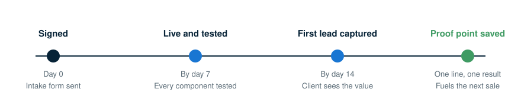

import KnowledgeCheck from "@site/src/components/KnowledgeCheck";
import CourseProgressBar from "@site/src/components/CourseProgressBar";
import SectionFeedback from "@site/src/components/SectionFeedback";
import InlineHighlighter from "@site/src/components/InlineHighlighter";
import MarkComplete from "@site/src/components/MarkComplete";
import LessonHeader from "@site/src/components/LessonHeader";
import LessonFooter from "@site/src/components/LessonFooter";
import LessonSection from "@site/src/components/LessonSection";
import KeyPoints from "@site/src/components/KeyPoints";

<InlineHighlighter courseId="from-signed-to-activated" site="vendasta_learn">

<CourseProgressBar courseId="from-signed-to-activated" site="vendasta_learn" />

<LessonHeader
  difficulty="Intermediate"
  topics={["Deployment", "Onboarding clients", "AI Workforce"]}
  time="about 18 minutes"
  lab={true}
  pathName="Sell the AI Workforce"
  step={7}
  totalSteps={8}
  outcomes={[
    "Collect everything a setup needs in one intake, the same day the client signs",
    "Run the go-live test that proves every component works before the client sees it",
    "Run a thirty-minute handoff call that leaves the client knowing where to look",
    "Capture the first-lead proof point that fuels your next sale",
  ]}
/>

## The clock starts at yes

Once a client signs, your job shifts from selling to deploying, and speed matters: the faster the client is live and capturing leads, the better your retention. Two targets shape the whole sequence: the AI employee live within 7 days of signing, and the first lead captured within 14.

<LessonSection>

## Collect what you need

Before you configure anything, gather what the setup needs, in a short intake call or a form you send the same day they sign:

- Business name, address, phone number, and website
- Business hours, including after-hours and weekends
- Services offered and approximate pricing
- The phone number the AI Receptionist should use: a new number or the existing line
- How the business wants to greet callers: tone, any custom phrases
- Logo file and brand color preferences
- Google Business Profile and Facebook page access
- Any existing CRM or scheduling tool

Build one reusable intake form. It takes the client ten minutes to fill out and saves hours of back-and-forth during setup.

:::tip Try it now
Draft your reusable intake form from the checklist above. Ten minutes now, and every deployment after this one starts ahead.
:::

</LessonSection>

## Configure, then prove it works

Start on your side, in Partner Center: activate the products on the client's account from its `Products` tab, and set up the billing, since the order, subscription, and retail pricing live in `Commerce`. Then work through the setup in the client's Business App: branding, the AI Receptionist's hours and greeting and lead-capture questions, the chat widget on their website, review sources connected, social accounts connected with the first posts scheduled, and any CRM or scheduling integrations. The [Hire your first AI Employee](/learn/ai-workforce) path covers the mechanics of each piece hands-on; this checklist is the order you run them in for a client.

Setup is complete when every component has passed a live test:

- Call the AI Receptionist from a mobile phone. It answers, greets correctly, and captures a lead.
- Send a test web chat. The AI responds and the lead appears in the inbox.
- Trigger a missed-call text-back. The SMS sends within seconds.
- Submit a review request manually. It goes out.
- Check the social post queue. The first post is scheduled.

That test run is also the moment worth describing to the client on the handoff call: their own business, answering its own phone.

<LessonSection>

## The handoff call

Thirty minutes, and the client leaves knowing where to look. Show them the dashboard: leads, review activity, conversation history. Play back a test call so they hear how their receptionist sounds. Confirm their notification preferences, walk through the approval workflow for flagged reviews, and confirm the social post schedule and how to approve or edit it. Then take questions.

Clients do not need to understand how it works. They need to know where to look and who to call.

</LessonSection>

## Capture the proof point

The moment your client captures their first real lead is what changes the relationship, and it fuels your next sale. Watch the lead feed for the first 48 to 72 hours after go-live. When the first lead lands, reach out: "Did you see that lead that came in last night?" Screenshot it and send it to them. If they followed up, ask how it went; a closed job at this stage is a case study.

Then save the result as one line: "HVAC client, 3 leads in first week." That line is your proof point, and it walks into every future sales conversation with you.

<LessonSection>

## Make it repeatable, and what 90 days looks like

The first deployment takes the longest. By the third you have a rhythm: the same intake form for every client, the setup checklist run in the same order, one proof-point line documented per client, and your signed-to-first-lead time tracked until it sits under 7 days.

<KeyPoints
  items={[
    {
      title: 'Day 30: first client signed',
      text: 'The warm-book outreach from earlier in this path lands its first yes.',
    },
    {
      title: 'Day 45: first client live and capturing',
      text: 'Deployed, tested, handed off, and the first leads are arriving.',
    },
    {
      title: 'Day 60: three clients signed, proof point documented',
      text: 'The one-line results are accumulating, and each one shortens the next sale.',
    },
    {
      title: 'Day 90: five clients live, a repeatable process',
      text: 'Roughly $2,500 in monthly recurring revenue at $500 per client, running on a rhythm you own.',
    },
  ]}
/>

Most partners who hit day 30 hit day 90. The first sale is the hard one, and everything in this path exists to make it happen.

</LessonSection>

<SectionFeedback courseId="from-signed-to-activated" site="vendasta_learn" section="content" />

<KnowledgeCheck courseId="from-signed-to-activated" site="vendasta_learn"
  sessionSize={3}
  intro="Three quick questions on the intake, the go-live test, and the proof point."
  questions={[
    {
      type: 'mcq',
      question: 'A client signed this morning. What goes out today?',
      options: [
        'The first invoice, so billing starts on time',
        'The intake form, collecting everything the setup needs in one pass',
        'The welcome email inviting them into Business App',
        'A meeting request for the handoff call'
      ],
      correctIndex: 1,
      explanation: 'The deployment clock starts at yes, and the intake form is what starts it: one pass collects the business details, hours, greeting, access, and tools the whole setup keys off.'
    },
    {
      type: 'mcq',
      question: 'Every configuration item is done. What makes the setup complete?',
      options: [
        'The client confirms the configuration looks right on a screen share',
        'Seven days have passed since signing',
        'The subscription shows as active on the account',
        'Every component passes a live test: the call, the chat, the text-back, the review request, and the post queue'
      ],
      correctIndex: 3,
      explanation: 'Configured is not the same as working. The live test run, calling it, chatting it, triggering the text-back, sending a review request, checking the queue, is the go-live gate.'
    },
    {
      type: 'mcq',
      question: 'It is 36 hours after go-live and a lead just came in overnight. What is the move?',
      options: [
        'Reach out now, screenshot the lead, and ask how the follow-up went',
        'Wait for the 30-day review to mention it with the full numbers',
        'Log it silently; the client will notice it in their dashboard',
        'Forward the lead to the client and mark the deployment finished'
      ],
      correctIndex: 0,
      explanation: 'The first captured lead is the activation moment. Reaching out while it is fresh ("Did you see that lead that came in last night?") turns it into a shared win, and a closed job here is a case study.'
    },
    {
      type: 'mcq',
      question: 'Which of these is a proof point you can carry into the next sales conversation?',
      options: [
        'A feeling that the client seems happier since go-live',
        'The full configuration checklist from the deployment',
        '"HVAC client, 3 leads in first week"',
        'A promise that results are coming once the system warms up'
      ],
      correctIndex: 2,
      explanation: 'One line, a named business type, a countable result. Document one per client and every future pitch opens with evidence instead of promises.'
    },
    {
      type: 'mcq',
      question: 'What belongs on the handoff call?',
      options: [
        'A walkthrough of how the AI models were configured behind the scenes',
        'The dashboard, a played-back test call, notifications, the review approval workflow, and the social schedule',
        'A renegotiation of the package price now that setup is done',
        'A training session on editing the AI\'s knowledge sources'
      ],
      correctIndex: 1,
      explanation: 'Clients do not need to understand how it works; they need to know where to look and who to call. Thirty minutes covers the dashboard, the test call, notifications, approvals, and the schedule.'
    }
  ]}
/>

<LessonFooter to="/learn/sell-the-ai-workforce/sell-ai-workforce-skill-check" pathName="Sell the AI Workforce" step={7} totalSteps={8} />

</InlineHighlighter>
<MarkComplete courseId="from-signed-to-activated" site="vendasta_learn" />
