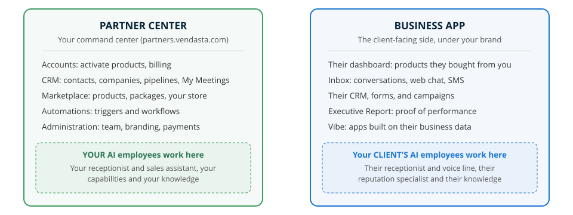

> **Superseded (July 4, 2026):** this step was merged into the combined lesson **The Vendasta Platform** (`the-vendasta-platform.mdx`, step 1 of 7). The lifecycle section (Attract/Convert/Engage) was cut entirely per Cal. Kept for history.

# REVIEW COPY — Ecosystem map, step 2 of Getting started (rewrite v6): The ecosystem map: how it all connects

> Full rewrite applying every rule from our critique. Interactive components shown as labeled blocks. Live rendering at `localhost:3400/learn/getting-started/ecosystem-map/` after next build. Not committed until you approve. Source annotations from the fact-check pass live in the git history of this file if you need them again; all [SYN] items were resolved (softened to "a pattern many partners use", story kept faithful to the real case, future-state section deleted).

**URL:** /learn/getting-started/ecosystem-map · **Position:** 2 of 8 in Getting started · **~7 min**

---

There are two main workspaces in the platform, and you will do real work in both: **Partner Center**, where you run your business and build your own AI workforce, and **Business App**, where you build the AI workforce for each of your clients. Let's walk through both so you can see everything at a glance.

> **BEFORE YOU START (info callout)**
> **Difficulty:** Beginner | **Time:** about 7 minutes

> **WHAT YOU WILL BE ABLE TO DO (tip callout)**
> - Say which workspace any task belongs to: Partner Center or Business App
> - Choose the right record for the job: account or CRM company
> - Place any AI Employee in the workspace it belongs to, before you configure it

## Two workspaces, one system

One question orients you anywhere in the platform: whose workspace am I in?

**Partner Center** is your command center: [accounts] and billing, your [CRM] and pipeline, [Marketplace] packages, [automations], and administration.

**Business App** is the client-facing side. Every client gets their own, under your brand: their dashboard, inbox, reports, and every product you activate for them. Their own brand lives inside it, in their business profile, and flows into everything they send: their campaigns, their review requests, their widgets. You have full access to configure products and AI Employees on their behalf. Some clients live in it daily; many are happy to let you drive.

The two workspaces stay connected. Products you activate in Partner Center appear in your client's Business App. Everything their business generates after that (leads, conversations, reviews, results) lands in their Business App, where you have full visibility, and the Executive Report turns those results into proof of your value, delivered to them under your brand.

> **TRY IT NOW (tip callout)**
> Open Partner Center and read the left navigation top to bottom. Everything you see there is the Partner Center side of the diagram above.

## What you set up in each

Here is how the split plays out in practice, side by side:

| | Partner Center (yours) | Business App (each client's) |
|---|---|---|
| **Brand** | Upload your logo once; it brands both workspaces | Carries your brand automatically |
| **People** | Invite your team, set permissions, and fill in salesperson profiles | Add client users and send the welcome email once their products are live |
| **Email** | Connect your email domain so everything the platform sends comes from you | Their notifications and reports send under your brand |
| **Money** | Connect payments and set your billing defaults | Their orders, subscriptions, and invoices live on their account |
| **AI Employees** | Your receptionist and sales assistant; serving your business | Their receptionist and specialists; serving their business |
| **Calendars** | Connect your calendar in My Meetings so booking works everywhere | Their meeting scheduler, once they have Conversations AI |
| **Products** | Choose what to sell and build packages in the Marketplace | Every product you activate appears as a dashboard for them |

Each row on this table becomes hands-on later in this learning path; for now, the pattern is the takeaway: set yourself up once on the left, then repeat the client side of the ritual for every business you bring on.

## Accounts and CRM companies: two records, two jobs

*You are here: Partner Center. Everything in this section happens in your workspace.*

Every business you work with can have two records, and each one has a clear job:

- **Log activity in the CRM company**: calls, notes, deals, follow-ups. This is your sales team's working file.
- **Activate and bill on the account**: products, subscriptions, Business App access. This is the business's service record with you.

The two stay connected for you. Creating an account automatically creates a linked CRM company. Started from the CRM instead? When the business is ready to buy, create the account right from the company record. Once linked, business information syncs between the two in both directions.

A pattern many partners use: prospect in the CRM, and create the account at the moment a business is ready to receive products. When you are ready to create your first account, [this guide walks you through it].

People follow the same pattern. A **CRM contact** is someone you are talking to. A **user** is someone you have invited into Business App. Contacts do not become users on their own: you create the user and send the welcome email when their products are ready for them.

## Where AI Employees live

Every AI Employee has a home base, and the rule for finding it is simple: **an AI Employee lives in the workspace of the business it serves.**

- **Your** AI Employees live in your Partner Center: the receptionist answering for your agency, your sales assistant, your capabilities and knowledge.
- **A client's** AI Employees live in their Business App: their receptionist, their voice line, their reputation specialist, powered by their business knowledge.

Pick the workspace first and everything downstream lands where you expect: channels, knowledge, conversations, and leads. When you are ready to configure one, [this guide will help].

## Products, AI Employees, and automations

Three building blocks, three different jobs:

| | What it is | Where it lives | Example |
|---|---|---|---|
| **Product** | Something you activate on an account and resell | Marketplace → the account | Local SEO, Conversations AI |
| **AI Employee** | A worker you configure with knowledge and capabilities | Partner Center or Business App | AI Receptionist, AI Sales Assistant |
| **Automation** | A trigger-and-action workflow that runs on its own | Automations, in either workspace | New form submission creates a follow-up task |

They compose: a product often unlocks an AI Employee, and automations carry work between them. That composition is "AI does the work, you orchestrate" in miniature.

> **[SECTION FEEDBACK component]**

> **[KNOWLEDGE CHECK — 3 questions drawn from a pool of 4; no H2 above it, the component's own header carries the section]**
> Intro line: "Three quick questions on the two workspaces, the two records, and where AI Employees live." 
> 0. *A prospect filled out your web form and you have been emailing back and forth. They have not bought anything yet. What are they in the platform?* → A contact in your CRM.
> 1. *Your client wants a chatbot on their website. Where do you configure that AI Employee?* → In their Business App, under AI.
> 2. *A prospect you have been tracking as a CRM company is ready to buy. What is your move?* → Create an account from the company record. (Explanation now includes the both-ways info sync.)
> 3. *You want a follow-up task created automatically every time a new lead comes in. Which building block is that?* → An automation you build. (All options now matched in length and register.)

---

Now that you have the ecosystem down, let's walk through your side of it: the [Partner Center walkthrough].

> **[MARK COMPLETE component]**

---

## What changed from v1 (for your review)

1. **Opening (v4, your dictated framing)**: two workspaces defined by whose AI workforce you are building — yours in Partner Center, your clients' in Business App. Fully factual descriptor, no story. The mistake story and all its traces are gone; the AI Employee rule is taught affirmatively ("every AI Employee has a home base").
2. **Prerequisite dropped** (not technical); **time honest** at 7 minutes; **veteran skip line removed** (Getting started assumes a new partner; skip affordances are reserved for mixed-audience paths).
3. **"Two main workspaces"** replaces the false absolute; Vendor Center and Developer Center survive unnamed.
4. **Business App reframed** per your correction + docs verification: client-facing, your brand, you often drive it on clients' behalf.
5. **One-way street renamed and rebuilt**: "Two records, two jobs," behavior first, platform-positive (no "trips people up"), includes the create-account-from-company flow and both-ways info sync the docs check surfaced. Prospecting advice softened to "a pattern many partners use."
6. **Micro-action added** (trace the left nav).
7. **"A map that stays true" deleted** — no change management or future state, per your rule.
8. **Knowledge check Q2 rebuilt** around the real flow; option lengths matched.
9. **No contractions** (except "let's" in your dictated footer), no em dashes, sentence-case headings throughout.
10. **Footer**: your exact line, with Partner Center walkthrough linked.
11. **Diagram subtitle** updated to "The client-facing side, under your brand."

12. **v5: doc references are task-anchored tags only** ("this guide walks you through it"), never meta-commentary about documentation. "Covers that whole world" deleted. **Vocabulary sweep:** "lesson" removed across all 19 training files; units are steps within learning paths; placeholders now read "This part of the learning path is being built."

13. **v6 (onboarding-call evidence, 10 new transcripts):** added the "What you set up in each" side-by-side table (each row verified against CS onboarding calls: logo brands both workspaces; team seats and salesperson profiles; email domain; payments and billing defaults; per-workspace AI employees; My Meetings; marketplace packages vs client product dashboards). Added the people version of the two-records rule (contact vs user, welcome email timing) verbatim from CS teaching. Added a fourth knowledge-check question on contact vs user. Fact-check outcome: the your-workforce/their-workforce opening is confirmed nearly verbatim by CS ("for most products you turn it on in Business App, but your chat and voice receptionists already exist for you in Partner Center").

14. **v6.1 (brand fact-check):** "under your brand" verified three ways (docs, CS onboarding calls, partner testimony) — Business App chrome wears the PARTNER's brand; the client's brand lives inside as business-profile data and flows into their outbound assets. One clarifying sentence added so learners do not hit the same ambiguity.

15. **v6.2 (channel-neutral wording, Cal's edit):** AI Employees table row uses semicolons and "serving your/their business" (not website); the home-base rule and its bullets updated to match ("the workspace of the business it serves") so voice lines and off-platform websites are not pigeonholed.

16. **v6.3 (workspace orientation, Cal's edit):** the two-records section now opens with a "You are here: Partner Center" location line, since everything before it discusses both workspaces. This becomes a standing convention: any section specific to one workspace opens with a "You are here" marker.

17. **v6.4 (flows rewrite, Cal's challenge):** "leads and proof of performance flow back to you" was compressing two truths into a backwards-reading arrow. Rewritten honestly: client results land in THEIR Business App; the partner gets visibility (as operator) and the Executive Report packages results as proof of the partner's value, delivered to the client. Diagram blue arrow relabeled from "Leads and proof" to "You see everything." Arrow endpoints also inset to touch borders without overlapping (v6.3.1). Rule earned: every arrow in a diagram must read truthfully in the direction it points.

18. **v6.5 (diagram simplified, Cal's call):** arrows and their labels removed from the diagram entirely; the two boxes stand side by side and the prose paragraph carries the connection story. Rule refined: when a diagram element needs this much correcting, delete it — the diagram shows structure, prose explains flow.

19. **v7 (metaphor discipline, Cal's call):** the "map" metaphor removed everywhere; title is now "The platform ecosystem: how it all connects", section heads are "Two workspaces, one system" and "Check your understanding", and the try-it/you-are-here lines reference the diagram and workspace directly. URL slug (/ecosystem-map) unchanged, so no redirect needed. Rule earned: commit to a metaphor everywhere or nowhere; decorative metaphors that only appear in some headings read as inconsistency.

20. **v7.1:** the diagram's internal title ("The Vendasta ecosystem: two workspaces, one system") removed as redundant with the section heading directly above it; canvas cropped to reclaim the space. Rule: the diagram never repeats the heading that introduces it.

21. **v7.2:** removed the H2 above the knowledge check (the component's own "Knowledge Check" header was doubling it) and added an `intro` prop to the KnowledgeCheck component so the lead-in names the actual content ("Three quick questions on the two workspaces, the two records, and where AI Employees live") instead of "random questions from a pool." Component change is backwards-compatible: existing lessons keep the default text. Rule: interaction blocks introduce themselves by content, not by mechanics.
